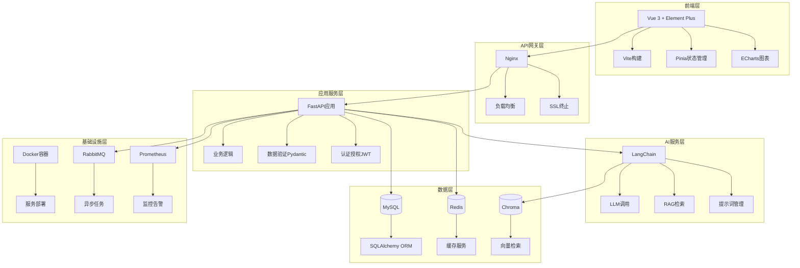

# 基于大语言模型的医疗智能体系统 - 技术方案选型文档

## 文档信息

| 项目 | 内容 |
|------|------|
| 文档名称 | 基于大语言模型的医疗智能体系统技术方案选型文档 |
| 文档版本 | V1.0 |
| 编写日期 | 2025年 |
| 文档状态 | 正式版 |

---

## 1. 选型原则

### 1.1 选型标准

1. **技术成熟度**：选择成熟稳定、社区活跃的技术栈
2. **开发效率**：优先选择开发效率高、学习成本低的技术
3. **性能要求**：满足系统性能需求（并发、响应时间等）
4. **可维护性**：代码结构清晰，易于维护和扩展
5. **生态支持**：丰富的第三方库和工具支持
6. **团队技能**：考虑团队现有技术栈和技能水平
7. **成本控制**：考虑开发成本和运维成本

### 1.2 技术栈确定

根据项目需求和选型原则，确定以下技术栈：
- **前端框架**：Vue.js 3.x
- **后端框架**：FastAPI
- **数据库**：MySQL 8.0+、Redis 7.0+
- **向量数据库**：Chroma
- **AI框架**：LangChain

---

## 2. 前端技术选型

### 2.1 核心框架：Vue.js 3.x

#### 2.1.1 选型理由

1. **Composition API**：提供更好的逻辑复用和代码组织
2. **性能优化**：响应式系统优化，性能提升显著
3. **TypeScript支持**：更好的类型检查和开发体验
4. **生态丰富**：丰富的组件库和工具支持
5. **学习曲线**：相对平缓，团队上手快
6. **社区活跃**：活跃的社区和持续更新

#### 2.1.2 版本选择

- **Vue.js**：3.4.x（最新稳定版）
- **Vue Router**：4.x（路由管理）
- **Pinia**：2.x（状态管理，替代Vuex）

#### 2.1.3 技术优势

```javascript
// Composition API示例
import { ref, computed } from 'vue'

export default {
  setup() {
    const count = ref(0)
    const doubleCount = computed(() => count.value * 2)
    return { count, doubleCount }
  }
}
```

### 2.2 UI组件库：Element Plus

#### 2.2.1 选型理由

1. **组件丰富**：提供完整的组件体系
2. **文档完善**：详细的中文文档和示例
3. **定制性强**：支持主题定制和样式覆盖
4. **TypeScript支持**：完整的类型定义
5. **Vue 3兼容**：专为Vue 3设计
6. **医疗场景适配**：组件适合医疗系统界面需求

#### 2.2.2 核心组件

- **布局组件**：Container、Layout
- **表单组件**：Form、Input、Select、DatePicker
- **数据展示**：Table、Card、Descriptions
- **反馈组件**：Message、Notification、Dialog
- **导航组件**：Menu、Breadcrumb、Tabs

### 2.3 图表库：ECharts

#### 2.3.1 选型理由

1. **功能强大**：支持多种图表类型
2. **性能优秀**：大数据量渲染性能好
3. **定制灵活**：丰富的配置选项
4. **文档完善**：详细的使用文档和示例
5. **Vue集成**：有Vue封装库（vue-echarts）
6. **医疗场景**：适合健康数据可视化需求

#### 2.3.2 图表类型

- **折线图**：体征趋势分析
- **雷达图**：健康多维度分析
- **柱状图**：数据对比分析
- **饼图**：数据分布展示
- **热力图**：用户行为分析

### 2.4 构建工具：Vite

#### 2.4.1 选型理由

1. **开发速度快**：基于ESM的快速HMR
2. **构建高效**：使用Rollup进行生产构建
3. **配置简单**：开箱即用，配置简洁
4. **插件生态**：丰富的插件支持
5. **TypeScript支持**：原生TypeScript支持

#### 2.4.2 配置文件示例

```typescript
// vite.config.ts
import { defineConfig } from 'vite'
import vue from '@vitejs/plugin-vue'
import path from 'path'

export default defineConfig({
  plugins: [vue()],
  resolve: {
    alias: {
      '@': path.resolve(__dirname, 'src')
    }
  },
  server: {
    port: 3000,
    proxy: {
      '/api': {
        target: 'http://localhost:8000',
        changeOrigin: true
      }
    }
  }
})
```

### 2.5 状态管理：Pinia

#### 2.5.1 选型理由

1. **Vue 3官方推荐**：Vuex的官方替代方案
2. **TypeScript支持**：更好的类型推断
3. **DevTools支持**：完整的开发工具支持
4. **代码分割**：自动代码分割
5. **API简洁**：更简洁的API设计

#### 2.5.2 Store示例

```typescript
// stores/user.ts
import { defineStore } from 'pinia'

export const useUserStore = defineStore('user', {
  state: () => ({
    userInfo: null,
    token: ''
  }),
  getters: {
    isLoggedIn: (state) => !!state.token
  },
  actions: {
    async login(credentials) {
      // 登录逻辑
    }
  }
})
```

### 2.6 HTTP客户端：Axios

#### 2.6.1 选型理由

1. **功能完善**：支持请求/响应拦截器
2. **Promise支持**：基于Promise的API
3. **自动转换**：自动转换JSON数据
4. **错误处理**：完善的错误处理机制
5. **请求取消**：支持请求取消功能

#### 2.6.2 封装示例

```typescript
// utils/request.ts
import axios from 'axios'
import { useUserStore } from '@/stores/user'

const request = axios.create({
  baseURL: '/api/v1',
  timeout: 10000
})

// 请求拦截器
request.interceptors.request.use(
  (config) => {
    const userStore = useUserStore()
    if (userStore.token) {
      config.headers.Authorization = `Bearer ${userStore.token}`
    }
    return config
  },
  (error) => Promise.reject(error)
)

// 响应拦截器
request.interceptors.response.use(
  (response) => response.data,
  (error) => {
    // 错误处理
    return Promise.reject(error)
  }
)

export default request
```

### 2.7 前端技术栈总结

| 技术 | 版本 | 用途 |
|------|------|------|
| Vue.js | 3.4.x | 核心框架 |
| Vue Router | 4.x | 路由管理 |
| Pinia | 2.x | 状态管理 |
| Element Plus | 2.x | UI组件库 |
| ECharts | 5.x | 图表库 |
| Axios | 1.x | HTTP客户端 |
| Vite | 5.x | 构建工具 |
| TypeScript | 5.x | 类型系统 |
| ESLint | 8.x | 代码检查 |
| Prettier | 3.x | 代码格式化 |

---

## 3. 后端技术选型

### 3.1 核心框架：FastAPI

#### 3.1.1 选型理由

1. **高性能**：基于Starlette和Pydantic，性能优秀
2. **自动文档**：自动生成OpenAPI/Swagger文档
3. **类型检查**：基于Pydantic的数据验证
4. **异步支持**：原生支持异步编程
5. **Python生态**：充分利用Python丰富的AI库
6. **开发效率**：代码简洁，开发效率高
7. **现代特性**：支持WebSocket、依赖注入等

#### 3.1.2 性能对比

- **FastAPI**：与Node.js和Go相当的性能
- **Django**：传统同步框架，性能较低
- **Flask**：轻量级但功能有限

#### 3.1.3 代码示例

```python
from fastapi import FastAPI, Depends, HTTPException
from pydantic import BaseModel
from typing import List

app = FastAPI(title="医疗智能体系统API")

class ConsultationRequest(BaseModel):
    symptoms: str
    user_id: int

@app.post("/api/v1/consultations")
async def create_consultation(
    request: ConsultationRequest,
    current_user: User = Depends(get_current_user)
):
    # 创建问诊逻辑
    return {"consultation_id": 1}
```

### 3.2 ORM框架：SQLAlchemy

#### 3.2.1 选型理由

1. **功能强大**：完整的ORM功能
2. **数据库支持**：支持多种数据库
3. **迁移工具**：Alembic数据库迁移工具
4. **关系映射**：完善的关系映射支持
5. **查询构建**：灵活的查询构建器
6. **异步支持**：支持异步操作

#### 3.2.2 模型示例

```python
from sqlalchemy import Column, Integer, String, DateTime, Text, ForeignKey
from sqlalchemy.orm import relationship
from sqlalchemy.ext.declarative import declarative_base

Base = declarative_base()

class User(Base):
    __tablename__ = 'users'
    
    user_id = Column(Integer, primary_key=True)
    username = Column(String(50), unique=True, nullable=False)
    phone = Column(String(20), unique=True)
    email = Column(String(100), unique=True)
    password_hash = Column(String(255), nullable=False)
    created_at = Column(DateTime)
    
    consultations = relationship("ConsultationRecord", back_populates="user")

class ConsultationRecord(Base):
    __tablename__ = 'consultation_records'
    
    consultation_id = Column(Integer, primary_key=True)
    user_id = Column(Integer, ForeignKey('users.user_id'), nullable=False)
    symptoms = Column(Text)
    conversation_history = Column(JSON)
    ai_suggestion = Column(Text)
    created_at = Column(DateTime)
    
    user = relationship("User", back_populates="consultations")
```

### 3.3 数据库：MySQL 8.0+

#### 3.3.1 选型理由

1. **成熟稳定**：广泛使用的成熟数据库
2. **性能优秀**：良好的查询性能
3. **事务支持**：完整的ACID事务支持
4. **JSON支持**：支持JSON数据类型
5. **索引优化**：丰富的索引类型
6. **运维成熟**：运维工具和监控完善

### 3.4 缓存：Redis 7.0+

#### 3.4.1 选型理由

1. **高性能**：内存数据库，读写速度快
2. **数据结构丰富**：支持多种数据结构
3. **持久化**：支持数据持久化
4. **分布式**：支持集群和主从复制
5. **应用场景**：
   - 会话缓存
   - 数据缓存
   - 分布式锁
   - 消息队列

#### 3.4.2 使用场景

```python
import redis
from fastapi import Depends

redis_client = redis.Redis(host='localhost', port=6379, db=0)

async def get_cached_data(key: str):
    cached = redis_client.get(key)
    if cached:
        return json.loads(cached)
    return None

async def set_cache(key: str, value: dict, expire: int = 3600):
    redis_client.setex(
        key, 
        expire, 
        json.dumps(value)
    )
```

### 3.5 认证授权：JWT

#### 3.5.1 选型理由

1. **无状态**：不需要服务器存储会话
2. **跨域支持**：适合前后端分离架构
3. **标准化**：JWT是标准协议
4. **安全性**：支持签名和加密
5. **扩展性**：可以携带用户信息

#### 3.5.2 实现示例

```python
from jose import JWTError, jwt
from datetime import datetime, timedelta

SECRET_KEY = "your-secret-key"
ALGORITHM = "HS256"

def create_access_token(data: dict, expires_delta: timedelta = None):
    to_encode = data.copy()
    if expires_delta:
        expire = datetime.utcnow() + expires_delta
    else:
        expire = datetime.utcnow() + timedelta(hours=24)
    to_encode.update({"exp": expire})
    encoded_jwt = jwt.encode(to_encode, SECRET_KEY, algorithm=ALGORITHM)
    return encoded_jwt

def verify_token(token: str):
    try:
        payload = jwt.decode(token, SECRET_KEY, algorithms=[ALGORITHM])
        return payload
    except JWTError:
        return None
```

### 3.6 文件存储：MinIO / 阿里云OSS

#### 3.6.1 选型理由

1. **对象存储**：适合存储图片、文档等文件
2. **S3兼容**：兼容AWS S3 API
3. **成本控制**：相比云服务更经济
4. **部署灵活**：可以自建或使用云服务

### 3.7 消息队列：RabbitMQ

#### 3.7.1 选型理由

1. **可靠性高**：消息持久化和确认机制
2. **功能丰富**：支持多种消息模式
3. **管理界面**：提供Web管理界面
4. **Python支持**：Celery集成良好
5. **应用场景**：
   - 异步任务处理
   - 邮件发送
   - 报告生成

### 3.8 后端技术栈总结

| 技术 | 版本 | 用途 |
|------|------|------|
| Python | 3.10+ | 开发语言 |
| FastAPI | 0.104+ | Web框架 |
| SQLAlchemy | 2.0+ | ORM框架 |
| Alembic | 1.12+ | 数据库迁移 |
| MySQL | 8.0+ | 关系数据库 |
| Redis | 7.0+ | 缓存数据库 |
| Pydantic | 2.0+ | 数据验证 |
| JWT | - | 认证授权 |
| Celery | 5.3+ | 异步任务 |
| RabbitMQ | 3.12+ | 消息队列 |

---

## 4. AI服务技术选型

### 4.1 LLM框架：LangChain

#### 4.1.1 选型理由

1. **模型抽象**：统一的模型接口
2. **链式调用**：支持复杂的AI应用链
3. **RAG支持**：内置检索增强生成支持
4. **工具集成**：丰富的工具和集成
5. **提示词管理**：完善的提示词管理
6. **多模型支持**：支持多种LLM提供商

#### 4.1.2 使用示例

```python
from langchain.llms import OpenAI
from langchain.chains import LLMChain
from langchain.prompts import PromptTemplate

llm = OpenAI(temperature=0.7)

prompt = PromptTemplate(
    input_variables=["symptoms"],
    template="根据以下症状描述，提供初步诊断建议：{symptoms}"
)

chain = LLMChain(llm=llm, prompt=prompt)
result = chain.run("头痛、发热、咳嗽")
```

### 4.2 向量数据库：Chroma

#### 4.2.1 选型理由

1. **轻量级**：Python原生，无需额外服务部署
2. **易用性**：简洁的API设计，上手快
3. **LangChain集成**：原生支持LangChain生态
4. **开发友好**：适合快速原型开发和小型项目
5. **持久化支持**：支持本地文件持久化存储
6. **开源免费**：开源项目，MIT许可证

#### 4.2.2 使用场景

- 医疗知识库向量化存储
- 相似症状检索
- RAG知识检索

#### 4.2.3 后续扩展说明

项目使用Chroma进行快速开发，当数据量增长或需要分布式部署时，可平滑迁移至Milvus或其他向量数据库。

### 4.3 大语言模型选择

#### 4.3.1 模型选项

1. **通义千问（阿里云百炼）**
   - 优势：国产大模型，中文理解能力强，成本较低，API稳定，国内访问便捷
   - 劣势：相对GPT-4性能略弱

2. **OpenAI GPT-4/GPT-3.5**
   - 优势：性能优秀，API稳定
   - 劣势：成本较高，需要网络访问

3. **文心一言**
   - 优势：国产模型，中文理解好
   - 劣势：API稳定性待验证

4. **Claude**
   - 优势：安全性好，长文本支持
   - 劣势：国内访问受限

#### 4.3.2 策略

- **主模型**：通义千问（阿里云百炼）- 适用于大多数医疗咨询场景
- **备用模型**：OpenAI GPT-4（高质量复杂场景）
- **成本优化**：根据场景选择合适模型，优先使用性价比高的通义千问

### 4.4 AI服务技术栈总结

| 技术 | 版本 | 用途 |
|------|------|------|
| LangChain | 0.1+ | LLM框架 |
| 通义千问（阿里云百炼） | - | 大语言模型 |
| Chroma | 0.4+ | 向量数据库 |
| sentence-transformers | 2.2+ | 文本向量化 |

---

## 5. 基础设施技术选型

### 5.1 容器化：Docker

#### 5.1.1 选型理由

1. **环境一致性**：开发、测试、生产环境一致
2. **部署便捷**：容器化部署简单
3. **资源隔离**：容器间资源隔离
4. **版本管理**：镜像版本管理

### 5.2 容器编排：Docker Compose / Kubernetes

#### 5.2.1 选型理由

- **开发环境**：Docker Compose（简单易用）
- **生产环境**：Kubernetes（大规模部署）

### 5.3 监控：Prometheus + Grafana

#### 5.3.1 选型理由

1. **指标收集**：Prometheus收集系统指标
2. **可视化**：Grafana提供可视化面板
3. **告警**：支持告警规则配置
4. **开源免费**：开源工具

### 5.4 日志：ELK Stack

#### 5.4.1 选型理由

1. **日志收集**：Logstash收集日志
2. **日志存储**：Elasticsearch存储
3. **日志分析**：Kibana分析和可视化
4. **全文搜索**：强大的搜索能力

### 5.5 基础设施技术栈总结

| 技术 | 版本 | 用途 |
|------|------|------|
| Docker | 24.0+ | 容器化 |
| Docker Compose | 2.20+ | 容器编排（开发） |
| Kubernetes | 1.28+ | 容器编排（生产） |
| Nginx | 1.25+ | 反向代理 |
| Prometheus | 2.47+ | 监控 |
| Grafana | 10.0+ | 可视化 |
| Elasticsearch | 8.10+ | 日志存储 |
| Logstash | 8.10+ | 日志收集 |
| Kibana | 8.10+ | 日志分析 |

---

## 6. 开发工具选型

### 6.1 代码管理：Git

- **版本控制**：Git
- **代码托管**：GitHub / GitLab
- **分支策略**：Git Flow

### 6.2 代码质量

- **代码检查**：ESLint（前端）、Pylint（后端）
- **代码格式化**：Prettier（前端）、Black（后端）
- **类型检查**：TypeScript（前端）、mypy（后端）

### 6.3 测试工具

- **单元测试**：Vitest（前端）、pytest（后端）
- **集成测试**：Jest、pytest
- **E2E测试**：Playwright

### 6.4 API文档

- **自动生成**：FastAPI自动生成Swagger文档
- **文档工具**：Swagger UI、ReDoc

---

## 7. 技术架构图



---

## 8. 技术选型总结

### 8.1 选型优势

1. **开发效率高**：Vue 3 + FastAPI组合开发效率高
2. **性能优秀**：FastAPI异步性能好，Vue 3响应式优化
3. **类型安全**：TypeScript + Pydantic提供类型检查
4. **生态丰富**：技术栈生态完善，工具支持好
5. **可维护性强**：代码结构清晰，易于维护

### 8.2 技术风险

1. **学习成本**：团队需要学习新技术栈
2. **兼容性**：新技术可能存在兼容性问题
3. **社区支持**：部分新技术社区支持可能不足

### 8.3 风险应对

1. **技术培训**：组织技术培训和知识分享
2. **渐进式采用**：逐步引入新技术，降低风险
3. **备选方案**：准备备选技术方案

---

## 9. 下一步工作

1. **环境搭建**：搭建开发、测试、生产环境
2. **项目初始化**：初始化前后端项目
3. **技术验证**：验证关键技术选型
4. **开发规范**：制定开发规范和代码规范
5. **文档完善**：完善技术文档和API文档

