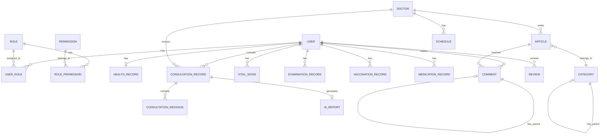
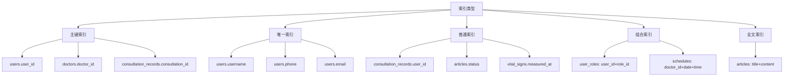

# 基于大语言模型的医疗智能体系统 - 数据库设计文档

## 文档信息

| 项目 | 内容 |
|------|------|
| 文档名称 | 基于大语言模型的医疗智能体系统数据库设计文档 |
| 文档版本 | V1.0 |
| 编写日期 | 2025年 |
| 文档状态 | 正式版 |

---

## 1. 设计概述

### 1.1 设计目标

1. **数据完整性**：保证数据的完整性和一致性
2. **性能优化**：合理的索引设计，提高查询性能
3. **可扩展性**：支持未来功能扩展
4. **安全性**：敏感数据加密存储
5. **规范化**：符合数据库设计范式

### 1.2 设计原则

1. **第三范式（3NF）**：消除传递依赖
2. **主键设计**：使用自增整数作为主键
3. **外键约束**：建立外键关系保证数据完整性
4. **索引设计**：为常用查询字段建立索引
5. **字段命名**：使用下划线命名法，语义清晰

### 1.3 命名规范

- **表名**：小写字母，下划线分隔，复数形式（如：users, consultation_records）
- **字段名**：小写字母，下划线分隔（如：user_id, created_at）
- **主键**：表名_id（如：user_id, consultation_id）
- **外键**：关联表名_id（如：user_id, doctor_id）
- **索引名**：idx_表名_字段名（如：idx_users_phone）

---

## 2. 数据库表设计

### 2.1 用户管理模块

#### 2.1.1 users（用户表）

| 字段名 | 类型 | 长度 | 说明 | 约束 | 默认值 |
|--------|------|------|------|------|--------|
| user_id | INT | - | 用户ID | PK, AUTO_INCREMENT | - |
| username | VARCHAR | 50 | 用户名 | UNIQUE, NOT NULL | - |
| phone | VARCHAR | 20 | 手机号 | UNIQUE | NULL |
| email | VARCHAR | 100 | 邮箱 | UNIQUE | NULL |
| password_hash | VARCHAR | 255 | 密码哈希值 | NOT NULL | - |
| avatar_url | VARCHAR | 255 | 头像URL | - | NULL |
| status | TINYINT | - | 状态（0禁用，1启用） | NOT NULL | 1 |
| created_at | DATETIME | - | 创建时间 | NOT NULL | CURRENT_TIMESTAMP |
| updated_at | DATETIME | - | 更新时间 | NOT NULL | CURRENT_TIMESTAMP ON UPDATE CURRENT_TIMESTAMP |

**索引：**
- PRIMARY KEY (user_id)
- UNIQUE KEY uk_users_username (username)
- UNIQUE KEY uk_users_phone (phone)
- UNIQUE KEY uk_users_email (email)
- INDEX idx_users_status (status)

#### 2.1.2 roles（角色表）

| 字段名 | 类型 | 长度 | 说明 | 约束 | 默认值 |
|--------|------|------|------|------|--------|
| role_id | INT | - | 角色ID | PK, AUTO_INCREMENT | - |
| role_name | VARCHAR | 50 | 角色名称 | UNIQUE, NOT NULL | - |
| description | VARCHAR | 255 | 角色描述 | - | NULL |
| status | TINYINT | - | 状态（0禁用，1启用） | NOT NULL | 1 |
| created_at | DATETIME | - | 创建时间 | NOT NULL | CURRENT_TIMESTAMP |
| updated_at | DATETIME | - | 更新时间 | NOT NULL | CURRENT_TIMESTAMP ON UPDATE CURRENT_TIMESTAMP |

**索引：**
- PRIMARY KEY (role_id)
- UNIQUE KEY uk_roles_role_name (role_name)

#### 2.1.3 permissions（权限表）

| 字段名 | 类型 | 长度 | 说明 | 约束 | 默认值 |
|--------|------|------|------|------|--------|
| permission_id | INT | - | 权限ID | PK, AUTO_INCREMENT | - |
| permission_name | VARCHAR | 100 | 权限名称 | UNIQUE, NOT NULL | - |
| resource | VARCHAR | 50 | 资源名称 | NOT NULL | - |
| action | VARCHAR | 50 | 操作类型 | NOT NULL | - |
| description | VARCHAR | 255 | 权限描述 | - | NULL |
| created_at | DATETIME | - | 创建时间 | NOT NULL | CURRENT_TIMESTAMP |

**索引：**
- PRIMARY KEY (permission_id)
- UNIQUE KEY uk_permissions_permission_name (permission_name)
- INDEX idx_permissions_resource (resource)

#### 2.1.4 user_roles（用户角色关联表）

| 字段名 | 类型 | 长度 | 说明 | 约束 | 默认值 |
|--------|------|------|------|------|--------|
| user_role_id | INT | - | 关联ID | PK, AUTO_INCREMENT | - |
| user_id | INT | - | 用户ID | FK, NOT NULL | - |
| role_id | INT | - | 角色ID | FK, NOT NULL | - |
| created_at | DATETIME | - | 创建时间 | NOT NULL | CURRENT_TIMESTAMP |

**索引：**
- PRIMARY KEY (user_role_id)
- UNIQUE KEY uk_user_roles_user_role (user_id, role_id)
- INDEX idx_user_roles_user_id (user_id)
- INDEX idx_user_roles_role_id (role_id)

**外键：**
- FOREIGN KEY (user_id) REFERENCES users(user_id) ON DELETE CASCADE
- FOREIGN KEY (role_id) REFERENCES roles(role_id) ON DELETE CASCADE

#### 2.1.5 role_permissions（角色权限关联表）

| 字段名 | 类型 | 长度 | 说明 | 约束 | 默认值 |
|--------|------|------|------|------|--------|
| role_permission_id | INT | - | 关联ID | PK, AUTO_INCREMENT | - |
| role_id | INT | - | 角色ID | FK, NOT NULL | - |
| permission_id | INT | - | 权限ID | FK, NOT NULL | - |
| created_at | DATETIME | - | 创建时间 | NOT NULL | CURRENT_TIMESTAMP |

**索引：**
- PRIMARY KEY (role_permission_id)
- UNIQUE KEY uk_role_permissions_role_permission (role_id, permission_id)
- INDEX idx_role_permissions_role_id (role_id)
- INDEX idx_role_permissions_permission_id (permission_id)

**外键：**
- FOREIGN KEY (role_id) REFERENCES roles(role_id) ON DELETE CASCADE
- FOREIGN KEY (permission_id) REFERENCES permissions(permission_id) ON DELETE CASCADE

---

### 2.2 问诊服务模块

#### 2.2.1 consultation_records（问诊记录表）

| 字段名 | 类型 | 长度 | 说明 | 约束 | 默认值 |
|--------|------|------|------|------|--------|
| consultation_id | INT | - | 问诊ID | PK, AUTO_INCREMENT | - |
| user_id | INT | - | 用户ID | FK, NOT NULL | - |
| doctor_id | INT | - | 医生ID | FK | NULL |
| symptoms | TEXT | - | 症状描述 | - | NULL |
| conversation_history | JSON | - | 对话历史 | - | NULL |
| ai_suggestion | TEXT | - | AI诊断建议 | - | NULL |
| doctor_review | TEXT | - | 医生审核意见 | - | NULL |
| status | TINYINT | - | 状态（0进行中，1已完成，2已取消，3待审核） | NOT NULL | 0 |
| created_at | DATETIME | - | 创建时间 | NOT NULL | CURRENT_TIMESTAMP |
| updated_at | DATETIME | - | 更新时间 | NOT NULL | CURRENT_TIMESTAMP ON UPDATE CURRENT_TIMESTAMP |

**索引：**
- PRIMARY KEY (consultation_id)
- INDEX idx_consultation_records_user_id (user_id)
- INDEX idx_consultation_records_doctor_id (doctor_id)
- INDEX idx_consultation_records_status (status)
- INDEX idx_consultation_records_created_at (created_at)

**外键：**
- FOREIGN KEY (user_id) REFERENCES users(user_id) ON DELETE CASCADE
- FOREIGN KEY (doctor_id) REFERENCES doctors(doctor_id) ON DELETE SET NULL

#### 2.2.2 consultation_messages（问诊消息表）

| 字段名 | 类型 | 长度 | 说明 | 约束 | 默认值 |
|--------|------|------|------|------|--------|
| message_id | INT | - | 消息ID | PK, AUTO_INCREMENT | - |
| consultation_id | INT | - | 问诊ID | FK, NOT NULL | - |
| sender_type | VARCHAR | 20 | 发送者类型（user/ai） | NOT NULL | - |
| content | TEXT | - | 消息内容 | NOT NULL | - |
| created_at | DATETIME | - | 创建时间 | NOT NULL | CURRENT_TIMESTAMP |

**索引：**
- PRIMARY KEY (message_id)
- INDEX idx_consultation_messages_consultation_id (consultation_id)
- INDEX idx_consultation_messages_created_at (created_at)

**外键：**
- FOREIGN KEY (consultation_id) REFERENCES consultation_records(consultation_id) ON DELETE CASCADE

#### 2.2.3 ai_reports（AI报告表）

| 字段名 | 类型 | 长度 | 说明 | 约束 | 默认值 |
|--------|------|------|------|------|--------|
| report_id | INT | - | 报告ID | PK, AUTO_INCREMENT | - |
| consultation_id | INT | - | 问诊ID | FK, NOT NULL | - |
| report_content | JSON | - | 报告内容 | - | NULL |
| report_file_url | VARCHAR | 255 | 报告文件URL | - | NULL |
| report_type | VARCHAR | 20 | 报告类型（text/image/pdf） | NOT NULL | 'text' |
| created_at | DATETIME | - | 创建时间 | NOT NULL | CURRENT_TIMESTAMP |

**索引：**
- PRIMARY KEY (report_id)
- UNIQUE KEY uk_ai_reports_consultation_id (consultation_id)
- INDEX idx_ai_reports_created_at (created_at)

**外键：**
- FOREIGN KEY (consultation_id) REFERENCES consultation_records(consultation_id) ON DELETE CASCADE

---

### 2.3 健康管理模块

#### 2.3.1 health_records（健康档案表）

| 字段名 | 类型 | 长度 | 说明 | 约束 | 默认值 |
|--------|------|------|------|------|--------|
| record_id | INT | - | 记录ID | PK, AUTO_INCREMENT | - |
| user_id | INT | - | 用户ID | FK, NOT NULL | - |
| blood_type | VARCHAR | 10 | 血型 | - | NULL |
| height | DECIMAL | 5,2 | 身高（cm） | - | NULL |
| weight | DECIMAL | 5,2 | 体重（kg） | - | NULL |
| medical_history | TEXT | - | 既往病史 | - | NULL |
| family_history | TEXT | - | 家族病史 | - | NULL |
| allergy_history | TEXT | - | 过敏史 | - | NULL |
| created_at | DATETIME | - | 创建时间 | NOT NULL | CURRENT_TIMESTAMP |
| updated_at | DATETIME | - | 更新时间 | NOT NULL | CURRENT_TIMESTAMP ON UPDATE CURRENT_TIMESTAMP |

**索引：**
- PRIMARY KEY (record_id)
- UNIQUE KEY uk_health_records_user_id (user_id)

**外键：**
- FOREIGN KEY (user_id) REFERENCES users(user_id) ON DELETE CASCADE

#### 2.3.2 vital_signs（体征数据表）

| 字段名 | 类型 | 长度 | 说明 | 约束 | 默认值 |
|--------|------|------|------|------|--------|
| sign_id | INT | - | 体征ID | PK, AUTO_INCREMENT | - |
| user_id | INT | - | 用户ID | FK, NOT NULL | - |
| sign_type | VARCHAR | 50 | 体征类型（血压/心率/体温/血糖等） | NOT NULL | - |
| value | DECIMAL | 10,2 | 数值 | NOT NULL | - |
| unit | VARCHAR | 20 | 单位 | NOT NULL | - |
| measured_at | DATETIME | - | 测量时间 | NOT NULL | - |
| notes | VARCHAR | 255 | 备注 | - | NULL |
| created_at | DATETIME | - | 创建时间 | NOT NULL | CURRENT_TIMESTAMP |

**索引：**
- PRIMARY KEY (sign_id)
- INDEX idx_vital_signs_user_id (user_id)
- INDEX idx_vital_signs_sign_type (sign_type)
- INDEX idx_vital_signs_measured_at (measured_at)

**外键：**
- FOREIGN KEY (user_id) REFERENCES users(user_id) ON DELETE CASCADE

#### 2.3.3 examination_records（检查记录表）

| 字段名 | 类型 | 长度 | 说明 | 约束 | 默认值 |
|--------|------|------|------|------|--------|
| examination_id | INT | - | 检查ID | PK, AUTO_INCREMENT | - |
| user_id | INT | - | 用户ID | FK, NOT NULL | - |
| examination_type | VARCHAR | 50 | 检查类型（血常规/尿常规/CT等） | NOT NULL | - |
| examination_data | JSON | - | 检查数据 | - | NULL |
| examination_date | DATE | - | 检查日期 | NOT NULL | - |
| hospital_name | VARCHAR | 100 | 医院名称 | - | NULL |
| doctor_name | VARCHAR | 50 | 医生姓名 | - | NULL |
| report_url | VARCHAR | 255 | 报告URL | - | NULL |
| created_at | DATETIME | - | 创建时间 | NOT NULL | CURRENT_TIMESTAMP |

**索引：**
- PRIMARY KEY (examination_id)
- INDEX idx_examination_records_user_id (user_id)
- INDEX idx_examination_records_examination_type (examination_type)
- INDEX idx_examination_records_examination_date (examination_date)

**外键：**
- FOREIGN KEY (user_id) REFERENCES users(user_id) ON DELETE CASCADE

#### 2.3.4 vaccination_records（疫苗接种记录表）

| 字段名 | 类型 | 长度 | 说明 | 约束 | 默认值 |
|--------|------|------|------|------|--------|
| vaccination_id | INT | - | 接种ID | PK, AUTO_INCREMENT | - |
| user_id | INT | - | 用户ID | FK, NOT NULL | - |
| vaccine_name | VARCHAR | 100 | 疫苗名称 | NOT NULL | - |
| vaccination_date | DATE | - | 接种日期 | NOT NULL | - |
| vaccination_agency | VARCHAR | 100 | 接种机构 | - | NULL |
| batch_number | VARCHAR | 50 | 批号 | - | NULL |
| next_vaccination_date | DATE | - | 下次接种日期 | - | NULL |
| notes | VARCHAR | 255 | 备注 | - | NULL |
| created_at | DATETIME | - | 创建时间 | NOT NULL | CURRENT_TIMESTAMP |

**索引：**
- PRIMARY KEY (vaccination_id)
- INDEX idx_vaccination_records_user_id (user_id)
- INDEX idx_vaccination_records_vaccination_date (vaccination_date)
- INDEX idx_vaccination_records_next_vaccination_date (next_vaccination_date)

**外键：**
- FOREIGN KEY (user_id) REFERENCES users(user_id) ON DELETE CASCADE

#### 2.3.5 medication_records（用药记录表）

| 字段名 | 类型 | 长度 | 说明 | 约束 | 默认值 |
|--------|------|------|------|------|--------|
| medication_id | INT | - | 用药ID | PK, AUTO_INCREMENT | - |
| user_id | INT | - | 用户ID | FK, NOT NULL | - |
| medication_name | VARCHAR | 100 | 药品名称 | NOT NULL | - |
| dosage | VARCHAR | 50 | 用法用量 | NOT NULL | - |
| frequency | VARCHAR | 50 | 用药频率 | NOT NULL | - |
| start_date | DATE | - | 开始日期 | NOT NULL | - |
| end_date | DATE | - | 结束日期 | - | NULL |
| reminder_enabled | TINYINT | - | 是否启用提醒（0否，1是） | NOT NULL | 1 |
| reminder_times | JSON | - | 提醒时间（JSON数组） | - | NULL |
| notes | VARCHAR | 255 | 备注 | - | NULL |
| created_at | DATETIME | - | 创建时间 | NOT NULL | CURRENT_TIMESTAMP |
| updated_at | DATETIME | - | 更新时间 | NOT NULL | CURRENT_TIMESTAMP ON UPDATE CURRENT_TIMESTAMP |

**索引：**
- PRIMARY KEY (medication_id)
- INDEX idx_medication_records_user_id (user_id)
- INDEX idx_medication_records_start_date (start_date)
- INDEX idx_medication_records_end_date (end_date)
- INDEX idx_medication_records_reminder_enabled (reminder_enabled)

**外键：**
- FOREIGN KEY (user_id) REFERENCES users(user_id) ON DELETE CASCADE

---

### 2.4 内容管理模块

#### 2.4.1 categories（分类表）

| 字段名 | 类型 | 长度 | 说明 | 约束 | 默认值 |
|--------|------|------|------|------|--------|
| category_id | INT | - | 分类ID | PK, AUTO_INCREMENT | - |
| category_name | VARCHAR | 50 | 分类名称 | NOT NULL | - |
| parent_id | INT | - | 父分类ID | FK | NULL |
| sort_order | INT | - | 排序号 | NOT NULL | 0 |
| description | VARCHAR | 255 | 分类描述 | - | NULL |
| status | TINYINT | - | 状态（0禁用，1启用） | NOT NULL | 1 |
| created_at | DATETIME | - | 创建时间 | NOT NULL | CURRENT_TIMESTAMP |
| updated_at | DATETIME | - | 更新时间 | NOT NULL | CURRENT_TIMESTAMP ON UPDATE CURRENT_TIMESTAMP |

**索引：**
- PRIMARY KEY (category_id)
- INDEX idx_categories_parent_id (parent_id)
- INDEX idx_categories_status (status)

**外键：**
- FOREIGN KEY (parent_id) REFERENCES categories(category_id) ON DELETE SET NULL

#### 2.4.2 articles（文章表）

| 字段名 | 类型 | 长度 | 说明 | 约束 | 默认值 |
|--------|------|------|------|------|--------|
| article_id | INT | - | 文章ID | PK, AUTO_INCREMENT | - |
| doctor_id | INT | - | 医生ID | FK | NULL |
| category_id | INT | - | 分类ID | FK, NOT NULL | - |
| title | VARCHAR | 200 | 文章标题 | NOT NULL | - |
| content | LONGTEXT | - | 文章内容 | NOT NULL | - |
| cover_image | VARCHAR | 255 | 封面图片URL | - | NULL |
| tags | VARCHAR | 255 | 标签（逗号分隔） | - | NULL |
| status | TINYINT | - | 状态（0草稿，1待审核，2已发布，3已下架） | NOT NULL | 0 |
| view_count | INT | - | 阅读量 | NOT NULL | 0 |
| like_count | INT | - | 点赞数 | NOT NULL | 0 |
| published_at | DATETIME | - | 发布时间 | - | NULL |
| created_at | DATETIME | - | 创建时间 | NOT NULL | CURRENT_TIMESTAMP |
| updated_at | DATETIME | - | 更新时间 | NOT NULL | CURRENT_TIMESTAMP ON UPDATE CURRENT_TIMESTAMP |

**索引：**
- PRIMARY KEY (article_id)
- INDEX idx_articles_doctor_id (doctor_id)
- INDEX idx_articles_category_id (category_id)
- INDEX idx_articles_status (status)
- INDEX idx_articles_published_at (published_at)
- FULLTEXT INDEX ft_articles_title_content (title, content)

**外键：**
- FOREIGN KEY (doctor_id) REFERENCES doctors(doctor_id) ON DELETE SET NULL
- FOREIGN KEY (category_id) REFERENCES categories(category_id) ON DELETE RESTRICT

#### 2.4.3 comments（评论表）

| 字段名 | 类型 | 长度 | 说明 | 约束 | 默认值 |
|--------|------|------|------|------|--------|
| comment_id | INT | - | 评论ID | PK, AUTO_INCREMENT | - |
| article_id | INT | - | 文章ID | FK, NOT NULL | - |
| user_id | INT | - | 用户ID | FK, NOT NULL | - |
| parent_id | INT | - | 父评论ID | FK | NULL |
| content | TEXT | - | 评论内容 | NOT NULL | - |
| status | TINYINT | - | 状态（0待审核，1已通过，2已拒绝） | NOT NULL | 0 |
| like_count | INT | - | 点赞数 | NOT NULL | 0 |
| created_at | DATETIME | - | 创建时间 | NOT NULL | CURRENT_TIMESTAMP |
| updated_at | DATETIME | - | 更新时间 | NOT NULL | CURRENT_TIMESTAMP ON UPDATE CURRENT_TIMESTAMP |

**索引：**
- PRIMARY KEY (comment_id)
- INDEX idx_comments_article_id (article_id)
- INDEX idx_comments_user_id (user_id)
- INDEX idx_comments_parent_id (parent_id)
- INDEX idx_comments_status (status)
- INDEX idx_comments_created_at (created_at)

**外键：**
- FOREIGN KEY (article_id) REFERENCES articles(article_id) ON DELETE CASCADE
- FOREIGN KEY (user_id) REFERENCES users(user_id) ON DELETE CASCADE
- FOREIGN KEY (parent_id) REFERENCES comments(comment_id) ON DELETE CASCADE

#### 2.4.4 reviews（审核表）

| 字段名 | 类型 | 长度 | 说明 | 约束 | 默认值 |
|--------|------|------|------|------|--------|
| review_id | INT | - | 审核ID | PK, AUTO_INCREMENT | - |
| reviewable_type | VARCHAR | 50 | 审核对象类型（article/comment） | NOT NULL | - |
| reviewable_id | INT | - | 审核对象ID | NOT NULL | - |
| reviewer_id | INT | - | 审核人ID | FK | NULL |
| review_result | TINYINT | - | 审核结果（0待审核，1通过，2拒绝） | NOT NULL | 0 |
| review_comment | TEXT | - | 审核意见 | - | NULL |
| created_at | DATETIME | - | 创建时间 | NOT NULL | CURRENT_TIMESTAMP |
| updated_at | DATETIME | - | 更新时间 | NOT NULL | CURRENT_TIMESTAMP ON UPDATE CURRENT_TIMESTAMP |

**索引：**
- PRIMARY KEY (review_id)
- INDEX idx_reviews_reviewable (reviewable_type, reviewable_id)
- INDEX idx_reviews_reviewer_id (reviewer_id)
- INDEX idx_reviews_review_result (review_result)

**外键：**
- FOREIGN KEY (reviewer_id) REFERENCES users(user_id) ON DELETE SET NULL

---

### 2.5 医生管理模块

#### 2.5.1 doctors（医生表）

| 字段名 | 类型 | 长度 | 说明 | 约束 | 默认值 |
|--------|------|------|------|------|--------|
| doctor_id | INT | - | 医生ID | PK, AUTO_INCREMENT | - |
| name | VARCHAR | 50 | 姓名 | NOT NULL | - |
| gender | TINYINT | - | 性别（0女，1男） | - | NULL |
| age | INT | - | 年龄 | - | NULL |
| department | VARCHAR | 50 | 科室 | NOT NULL | - |
| title | VARCHAR | 50 | 职称 | - | NULL |
| specialties | TEXT | - | 擅长领域 | - | NULL |
| certificate_url | VARCHAR | 255 | 资质证书URL | - | NULL |
| avatar_url | VARCHAR | 255 | 头像URL | - | NULL |
| introduction | TEXT | - | 简介 | - | NULL |
| phone | VARCHAR | 20 | 联系电话 | - | NULL |
| email | VARCHAR | 100 | 邮箱 | - | NULL |
| status | TINYINT | - | 状态（0禁用，1启用） | NOT NULL | 1 |
| created_at | DATETIME | - | 创建时间 | NOT NULL | CURRENT_TIMESTAMP |
| updated_at | DATETIME | - | 更新时间 | NOT NULL | CURRENT_TIMESTAMP ON UPDATE CURRENT_TIMESTAMP |

**索引：**
- PRIMARY KEY (doctor_id)
- INDEX idx_doctors_department (department)
- INDEX idx_doctors_status (status)

#### 2.5.2 schedules（排班表）

| 字段名 | 类型 | 长度 | 说明 | 约束 | 默认值 |
|--------|------|------|------|------|--------|
| schedule_id | INT | - | 排班ID | PK, AUTO_INCREMENT | - |
| doctor_id | INT | - | 医生ID | FK, NOT NULL | - |
| date | DATE | - | 日期 | NOT NULL | - |
| start_time | TIME | - | 开始时间 | NOT NULL | - |
| end_time | TIME | - | 结束时间 | NOT NULL | - |
| status | TINYINT | - | 状态（0已取消，1正常） | NOT NULL | 1 |
| created_at | DATETIME | - | 创建时间 | NOT NULL | CURRENT_TIMESTAMP |
| updated_at | DATETIME | - | 更新时间 | NOT NULL | CURRENT_TIMESTAMP ON UPDATE CURRENT_TIMESTAMP |

**索引：**
- PRIMARY KEY (schedule_id)
- INDEX idx_schedules_doctor_id (doctor_id)
- INDEX idx_schedules_date (date)
- UNIQUE KEY uk_schedules_doctor_date_time (doctor_id, date, start_time, end_time)

**外键：**
- FOREIGN KEY (doctor_id) REFERENCES doctors(doctor_id) ON DELETE CASCADE

---

### 2.6 系统配置模块

#### 2.6.1 system_configs（系统配置表）

| 字段名 | 类型 | 长度 | 说明 | 约束 | 默认值 |
|--------|------|------|------|------|--------|
| config_id | INT | - | 配置ID | PK, AUTO_INCREMENT | - |
| config_key | VARCHAR | 100 | 配置键 | UNIQUE, NOT NULL | - |
| config_value | TEXT | - | 配置值 | - | NULL |
| config_type | VARCHAR | 50 | 配置类型 | NOT NULL | - |
| description | VARCHAR | 255 | 配置描述 | - | NULL |
| created_at | DATETIME | - | 创建时间 | NOT NULL | CURRENT_TIMESTAMP |
| updated_at | DATETIME | - | 更新时间 | NOT NULL | CURRENT_TIMESTAMP ON UPDATE CURRENT_TIMESTAMP |

**索引：**
- PRIMARY KEY (config_id)
- UNIQUE KEY uk_system_configs_config_key (config_key)
- INDEX idx_system_configs_config_type (config_type)

#### 2.6.2 operation_logs（操作日志表）

| 字段名 | 类型 | 长度 | 说明 | 约束 | 默认值 |
|--------|------|------|------|------|--------|
| log_id | INT | - | 日志ID | PK, AUTO_INCREMENT | - |
| user_id | INT | - | 用户ID | FK | NULL |
| operation_type | VARCHAR | 50 | 操作类型 | NOT NULL | - |
| resource_type | VARCHAR | 50 | 资源类型 | NOT NULL | - |
| resource_id | INT | - | 资源ID | - | NULL |
| operation_desc | VARCHAR | 255 | 操作描述 | - | NULL |
| ip_address | VARCHAR | 50 | IP地址 | - | NULL |
| user_agent | VARCHAR | 255 | 用户代理 | - | NULL |
| created_at | DATETIME | - | 创建时间 | NOT NULL | CURRENT_TIMESTAMP |

**索引：**
- PRIMARY KEY (log_id)
- INDEX idx_operation_logs_user_id (user_id)
- INDEX idx_operation_logs_operation_type (operation_type)
- INDEX idx_operation_logs_resource (resource_type, resource_id)
- INDEX idx_operation_logs_created_at (created_at)

**外键：**
- FOREIGN KEY (user_id) REFERENCES users(user_id) ON DELETE SET NULL

#### 2.6.3 login_logs（登录日志表）

| 字段名 | 类型 | 长度 | 说明 | 约束 | 默认值 |
|--------|------|------|------|------|--------|
| login_log_id | INT | - | 登录日志ID | PK, AUTO_INCREMENT | - |
| user_id | INT | - | 用户ID | FK | NULL |
| login_type | VARCHAR | 20 | 登录类型（password/sms/third_party） | NOT NULL | - |
| ip_address | VARCHAR | 50 | IP地址 | - | NULL |
| user_agent | VARCHAR | 255 | 用户代理 | - | NULL |
| device_info | VARCHAR | 255 | 设备信息 | - | NULL |
| login_status | TINYINT | - | 登录状态（0失败，1成功） | NOT NULL | - |
| failure_reason | VARCHAR | 255 | 失败原因 | - | NULL |
| created_at | DATETIME | - | 创建时间 | NOT NULL | CURRENT_TIMESTAMP |

**索引：**
- PRIMARY KEY (login_log_id)
- INDEX idx_login_logs_user_id (user_id)
- INDEX idx_login_logs_login_status (login_status)
- INDEX idx_login_logs_created_at (created_at)

**外键：**
- FOREIGN KEY (user_id) REFERENCES users(user_id) ON DELETE SET NULL

#### 2.6.4 notifications（通知表）

| 字段名 | 类型 | 长度 | 说明 | 约束 | 默认值 |
|--------|------|------|------|------|--------|
| notification_id | INT | - | 通知ID | PK, AUTO_INCREMENT | - |
| user_id | INT | - | 用户ID | FK, NOT NULL | - |
| notification_type | VARCHAR | 50 | 通知类型 | NOT NULL | - |
| title | VARCHAR | 200 | 通知标题 | NOT NULL | - |
| content | TEXT | - | 通知内容 | NOT NULL | - |
| is_read | TINYINT | - | 是否已读（0未读，1已读） | NOT NULL | 0 |
| read_at | DATETIME | - | 阅读时间 | - | NULL |
| created_at | DATETIME | - | 创建时间 | NOT NULL | CURRENT_TIMESTAMP |

**索引：**
- PRIMARY KEY (notification_id)
- INDEX idx_notifications_user_id (user_id)
- INDEX idx_notifications_is_read (is_read)
- INDEX idx_notifications_created_at (created_at)

**外键：**
- FOREIGN KEY (user_id) REFERENCES users(user_id) ON DELETE CASCADE

---

## 3. 全局E-R图（陈氏表示法）

### 3.1 全局E-R图说明

陈氏表示法（Chen's Notation）E-R图使用以下符号：
- **矩形**：表示实体（Entity）
- **椭圆**：表示属性（Attribute）
- **菱形**：表示关系（Relationship）
- **双线椭圆**：表示多值属性
- **下划线**：表示主键属性
- **连接线**：表示实体、属性和关系之间的关联

### 3.2 全局E-R图文本描述

```
全局E-R图结构：

实体（矩形）：
- USER（用户）
  - user_id (PK)
  - username
  - phone
  - email
  - password_hash
  - avatar_url
  - status
  - created_at
  - updated_at

- DOCTOR（医生）
  - doctor_id (PK)
  - name
  - gender
  - age
  - department
  - title
  - specialties
  - certificate_url
  - avatar_url
  - introduction
  - phone
  - email
  - status
  - created_at
  - updated_at

- ROLE（角色）
  - role_id (PK)
  - role_name
  - description
  - status
  - created_at
  - updated_at

- PERMISSION（权限）
  - permission_id (PK)
  - permission_name
  - resource
  - action
  - description
  - created_at

- CONSULTATION_RECORD（问诊记录）
  - consultation_id (PK)
  - symptoms
  - conversation_history
  - ai_suggestion
  - doctor_review
  - status
  - created_at
  - updated_at

- HEALTH_RECORD（健康档案）
  - record_id (PK)
  - blood_type
  - height
  - weight
  - medical_history
  - family_history
  - allergy_history
  - created_at
  - updated_at

- VITAL_SIGNS（体征数据）
  - sign_id (PK)
  - sign_type
  - value
  - unit
  - measured_at
  - notes
  - created_at

- EXAMINATION_RECORD（检查记录）
  - examination_id (PK)
  - examination_type
  - examination_data
  - examination_date
  - hospital_name
  - doctor_name
  - report_url
  - created_at

- VACCINATION_RECORD（疫苗接种记录）
  - vaccination_id (PK)
  - vaccine_name
  - vaccination_date
  - vaccination_agency
  - batch_number
  - next_vaccination_date
  - notes
  - created_at

- MEDICATION_RECORD（用药记录）
  - medication_id (PK)
  - medication_name
  - dosage
  - frequency
  - start_date
  - end_date
  - reminder_enabled
  - reminder_times
  - notes
  - created_at
  - updated_at

- CATEGORY（分类）
  - category_id (PK)
  - category_name
  - parent_id (FK)
  - sort_order
  - description
  - status
  - created_at
  - updated_at

- ARTICLE（文章）
  - article_id (PK)
  - title
  - content
  - cover_image
  - tags
  - status
  - view_count
  - like_count
  - published_at
  - created_at
  - updated_at

- COMMENT（评论）
  - comment_id (PK)
  - parent_id (FK)
  - content
  - status
  - like_count
  - created_at
  - updated_at

- REVIEW（审核）
  - review_id (PK)
  - reviewable_type
  - reviewable_id
  - review_result
  - review_comment
  - created_at
  - updated_at

- SCHEDULE（排班）
  - schedule_id (PK)
  - date
  - start_time
  - end_time
  - status
  - created_at
  - updated_at

- CONSULTATION_MESSAGE（问诊消息）
  - message_id (PK)
  - sender_type
  - content
  - created_at

- AI_REPORT（AI报告）
  - report_id (PK)
  - report_content
  - report_file_url
  - report_type
  - created_at

关系（菱形）：
- HAS_ROLE（用户拥有角色）：USER <---> ROLE (M:N)
- HAS_PERMISSION（角色拥有权限）：ROLE <---> PERMISSION (M:N)
- CONSULTS（用户进行问诊）：USER ---> CONSULTATION_RECORD (1:N)
- REVIEWS（医生审核问诊）：DOCTOR ---> CONSULTATION_RECORD (1:N)
- HAS_HEALTH_RECORD（用户拥有健康档案）：USER ---> HEALTH_RECORD (1:1)
- HAS_VITAL_SIGNS（用户有体征数据）：USER ---> VITAL_SIGNS (1:N)
- HAS_EXAMINATION（用户有检查记录）：USER ---> EXAMINATION_RECORD (1:N)
- HAS_VACCINATION（用户有疫苗接种）：USER ---> VACCINATION_RECORD (1:N)
- HAS_MEDICATION（用户有用药记录）：USER ---> MEDICATION_RECORD (1:N)
- WRITES（医生写文章）：DOCTOR ---> ARTICLE (1:N)
- BELONGS_TO_CATEGORY（文章属于分类）：ARTICLE ---> CATEGORY (N:1)
- HAS_PARENT（分类有父分类）：CATEGORY ---> CATEGORY (N:1)
- COMMENTS_ON（用户评论文章）：USER ---> COMMENT (1:N)
- RECEIVES_COMMENT（文章接收评论）：ARTICLE ---> COMMENT (1:N)
- HAS_PARENT_COMMENT（评论有父评论）：COMMENT ---> COMMENT (N:1)
- REVIEWS_CONTENT（审核内容）：USER ---> REVIEW (1:N)
- HAS_MESSAGES（问诊有消息）：CONSULTATION_RECORD ---> CONSULTATION_MESSAGE (1:N)
- GENERATES_REPORT（问诊生成报告）：CONSULTATION_RECORD ---> AI_REPORT (1:1)
- HAS_SCHEDULE（医生有排班）：DOCTOR ---> SCHEDULE (1:N)
```

### 3.3 全局E-R图（Mermaid格式）

由于Mermaid不支持陈氏表示法，这里提供简化版的关系图：



---

## 4. 模块E-R图（陈氏表示法）

### 4.1 用户管理模块E-R图

**实体：**
- USER（用户）
- ROLE（角色）
- PERMISSION（权限）

**关系：**
- HAS_ROLE：USER <---> ROLE (M:N，通过user_roles表)
- HAS_PERMISSION：ROLE <---> PERMISSION (M:N，通过role_permissions表)

**文本描述：**
```
USER实体：
  - user_id (PK, 下划线)
  - username
  - phone
  - email
  - password_hash
  - avatar_url
  - status
  - created_at
  - updated_at

ROLE实体：
  - role_id (PK, 下划线)
  - role_name
  - description
  - status
  - created_at
  - updated_at

PERMISSION实体：
  - permission_id (PK, 下划线)
  - permission_name
  - resource
  - action
  - description
  - created_at

关系：
  USER --[HAS_ROLE]-- ROLE (M:N)
  ROLE --[HAS_PERMISSION]-- PERMISSION (M:N)
```

### 4.2 问诊服务模块E-R图

**实体：**
- USER（用户）
- DOCTOR（医生）
- CONSULTATION_RECORD（问诊记录）
- CONSULTATION_MESSAGE（问诊消息）
- AI_REPORT（AI报告）

**关系：**
- CONSULTS：USER ---> CONSULTATION_RECORD (1:N)
- REVIEWS：DOCTOR ---> CONSULTATION_RECORD (1:N)
- CONTAINS：CONSULTATION_RECORD ---> CONSULTATION_MESSAGE (1:N)
- GENERATES：CONSULTATION_RECORD ---> AI_REPORT (1:1)

**文本描述：**
```
CONSULTATION_RECORD实体：
  - consultation_id (PK, 下划线)
  - symptoms
  - conversation_history (多值属性，JSON)
  - ai_suggestion
  - doctor_review
  - status
  - created_at
  - updated_at

CONSULTATION_MESSAGE实体：
  - message_id (PK, 下划线)
  - sender_type
  - content
  - created_at

AI_REPORT实体：
  - report_id (PK, 下划线)
  - report_content (多值属性，JSON)
  - report_file_url
  - report_type
  - created_at

关系：
  USER --[CONSULTS]--> CONSULTATION_RECORD (1:N)
  DOCTOR --[REVIEWS]--> CONSULTATION_RECORD (1:N)
  CONSULTATION_RECORD --[CONTAINS]--> CONSULTATION_MESSAGE (1:N)
  CONSULTATION_RECORD --[GENERATES]--> AI_REPORT (1:1)
```

### 4.3 健康管理模块E-R图

**实体：**
- USER（用户）
- HEALTH_RECORD（健康档案）
- VITAL_SIGNS（体征数据）
- EXAMINATION_RECORD（检查记录）
- VACCINATION_RECORD（疫苗接种记录）
- MEDICATION_RECORD（用药记录）

**关系：**
- HAS_HEALTH_RECORD：USER ---> HEALTH_RECORD (1:1)
- HAS_VITAL_SIGNS：USER ---> VITAL_SIGNS (1:N)
- HAS_EXAMINATION：USER ---> EXAMINATION_RECORD (1:N)
- HAS_VACCINATION：USER ---> VACCINATION_RECORD (1:N)
- HAS_MEDICATION：USER ---> MEDICATION_RECORD (1:N)

**文本描述：**
```
HEALTH_RECORD实体：
  - record_id (PK, 下划线)
  - blood_type
  - height
  - weight
  - medical_history
  - family_history
  - allergy_history
  - created_at
  - updated_at

VITAL_SIGNS实体：
  - sign_id (PK, 下划线)
  - sign_type
  - value
  - unit
  - measured_at
  - notes
  - created_at

EXAMINATION_RECORD实体：
  - examination_id (PK, 下划线)
  - examination_type
  - examination_data (多值属性，JSON)
  - examination_date
  - hospital_name
  - doctor_name
  - report_url
  - created_at

VACCINATION_RECORD实体：
  - vaccination_id (PK, 下划线)
  - vaccine_name
  - vaccination_date
  - vaccination_agency
  - batch_number
  - next_vaccination_date
  - notes
  - created_at

MEDICATION_RECORD实体：
  - medication_id (PK, 下划线)
  - medication_name
  - dosage
  - frequency
  - start_date
  - end_date
  - reminder_enabled
  - reminder_times (多值属性，JSON)
  - notes
  - created_at
  - updated_at

关系：
  USER --[HAS_HEALTH_RECORD]--> HEALTH_RECORD (1:1)
  USER --[HAS_VITAL_SIGNS]--> VITAL_SIGNS (1:N)
  USER --[HAS_EXAMINATION]--> EXAMINATION_RECORD (1:N)
  USER --[HAS_VACCINATION]--> VACCINATION_RECORD (1:N)
  USER --[HAS_MEDICATION]--> MEDICATION_RECORD (1:N)
```

### 4.4 内容管理模块E-R图

**实体：**
- DOCTOR（医生）
- CATEGORY（分类）
- ARTICLE（文章）
- COMMENT（评论）
- USER（用户）
- REVIEW（审核）

**关系：**
- WRITES：DOCTOR ---> ARTICLE (1:N)
- BELONGS_TO：ARTICLE ---> CATEGORY (N:1)
- HAS_PARENT：CATEGORY ---> CATEGORY (N:1)
- COMMENTS_ON：USER ---> COMMENT (1:N)
- RECEIVES_COMMENT：ARTICLE ---> COMMENT (1:N)
- HAS_PARENT_COMMENT：COMMENT ---> COMMENT (N:1)
- REVIEWS_CONTENT：USER ---> REVIEW (1:N)

**文本描述：**
```
CATEGORY实体：
  - category_id (PK, 下划线)
  - category_name
  - parent_id (FK, 下划线)
  - sort_order
  - description
  - status
  - created_at
  - updated_at

ARTICLE实体：
  - article_id (PK, 下划线)
  - title
  - content
  - cover_image
  - tags (多值属性)
  - status
  - view_count
  - like_count
  - published_at
  - created_at
  - updated_at

COMMENT实体：
  - comment_id (PK, 下划线)
  - parent_id (FK, 下划线)
  - content
  - status
  - like_count
  - created_at
  - updated_at

REVIEW实体：
  - review_id (PK, 下划线)
  - reviewable_type
  - reviewable_id
  - review_result
  - review_comment
  - created_at
  - updated_at

关系：
  DOCTOR --[WRITES]--> ARTICLE (1:N)
  ARTICLE --[BELONGS_TO]--> CATEGORY (N:1)
  CATEGORY --[HAS_PARENT]--> CATEGORY (N:1)
  USER --[COMMENTS_ON]--> COMMENT (1:N)
  ARTICLE --[RECEIVES_COMMENT]--> COMMENT (1:N)
  COMMENT --[HAS_PARENT_COMMENT]--> COMMENT (N:1)
  USER --[REVIEWS_CONTENT]--> REVIEW (1:N)
```

### 4.5 医生管理模块E-R图

**实体：**
- DOCTOR（医生）
- SCHEDULE（排班）

**关系：**
- HAS_SCHEDULE：DOCTOR ---> SCHEDULE (1:N)

**文本描述：**
```
SCHEDULE实体：
  - schedule_id (PK, 下划线)
  - date
  - start_time
  - end_time
  - status
  - created_at
  - updated_at

关系：
  DOCTOR --[HAS_SCHEDULE]--> SCHEDULE (1:N)
```

---

## 5. 数据库索引设计

### 5.1 索引设计原则

1. **主键索引**：每个表必须有主键索引
2. **唯一索引**：唯一约束字段建立唯一索引
3. **外键索引**：外键字段建立索引
4. **查询索引**：常用查询条件字段建立索引
5. **组合索引**：多字段查询建立组合索引
6. **全文索引**：文本搜索字段建立全文索引

### 5.2 索引统计表



---

## 6. 数据库约束设计

### 6.1 主键约束

所有表都有自增主键，保证唯一性。

### 6.2 外键约束

外键约束保证数据完整性：
- **ON DELETE CASCADE**：删除主表记录时，删除关联记录（如：用户删除时删除其所有数据）
- **ON DELETE SET NULL**：删除主表记录时，外键设为NULL（如：医生删除时，问诊记录的doctor_id设为NULL）
- **ON DELETE RESTRICT**：删除主表记录时，如果有关联记录则禁止删除（如：分类删除时，如果有文章则禁止删除）

### 6.3 唯一约束

- 用户表：username、phone、email唯一
- 角色表：role_name唯一
- 权限表：permission_name唯一
- 系统配置表：config_key唯一

### 6.4 检查约束

- status字段：0或1（部分表支持更多状态值）
- gender字段：0或1
- 数值字段：合理范围检查（如：height > 0, weight > 0）

---

## 7. 数据库优化建议

### 7.1 查询优化

1. **避免全表扫描**：为常用查询字段建立索引
2. **使用覆盖索引**：查询字段都在索引中，避免回表
3. **分页查询优化**：使用LIMIT和OFFSET，大数据量使用游标分页
4. **避免SELECT ***：只查询需要的字段

### 7.2 表结构优化

1. **字段类型选择**：选择合适的数据类型，避免浪费空间
2. **NULL值处理**：合理使用NULL，避免不必要的NULL字段
3. **JSON字段**：合理使用JSON存储非结构化数据
4. **分区表**：大数据量表考虑分区（如：日志表按时间分区）

### 7.3 读写分离

1. **主从复制**：主库写，从库读
2. **读写分离中间件**：使用MyCat、ShardingSphere等
3. **缓存策略**：热点数据使用Redis缓存

---

## 8. 数据字典

### 8.1 状态字段枚举值

| 表名 | 字段名 | 枚举值 | 说明 |
|------|--------|--------|------|
| users | status | 0, 1 | 0=禁用, 1=启用 |
| consultation_records | status | 0, 1, 2, 3 | 0=进行中, 1=已完成, 2=已取消, 3=待审核 |
| articles | status | 0, 1, 2, 3 | 0=草稿, 1=待审核, 2=已发布, 3=已下架 |
| comments | status | 0, 1, 2 | 0=待审核, 1=已通过, 2=已拒绝 |
| reviews | review_result | 0, 1, 2 | 0=待审核, 1=通过, 2=拒绝 |
| schedules | status | 0, 1 | 0=已取消, 1=正常 |
| doctors | gender | 0, 1 | 0=女, 1=男 |

### 8.2 常用字段说明

| 字段名 | 类型 | 说明 | 示例 |
|--------|------|------|------|
| created_at | DATETIME | 创建时间 | 2025-01-01 10:00:00 |
| updated_at | DATETIME | 更新时间 | 2025-01-01 11:00:00 |
| status | TINYINT | 状态 | 0或1 |
| *_id | INT | 主键ID | 自增整数 |

---

## 9. 数据库维护

### 9.1 备份策略

1. **全量备份**：每天凌晨进行全量备份
2. **增量备份**：每小时进行增量备份
3. **备份保留**：全量备份保留30天，增量备份保留7天
4. **备份验证**：定期验证备份文件完整性

### 9.2 监控指标

1. **性能指标**：查询响应时间、慢查询数量
2. **容量指标**：数据库大小、表大小、索引大小
3. **连接指标**：连接数、活跃连接数
4. **错误指标**：错误日志、死锁次数

### 9.3 优化建议

1. **定期分析表**：使用ANALYZE TABLE更新统计信息
2. **优化表**：使用OPTIMIZE TABLE优化表结构
3. **清理数据**：定期清理历史数据和日志数据
4. **索引维护**：定期检查索引使用情况，删除无用索引

---

## 10. 总结

### 10.1 设计特点

1. **规范化设计**：符合第三范式，减少数据冗余
2. **完整性约束**：完善的主键、外键、唯一约束
3. **索引优化**：合理的索引设计，提高查询性能
4. **扩展性**：支持未来功能扩展

### 10.2 后续工作

1. **性能测试**：进行数据库性能测试
2. **优化调整**：根据测试结果优化索引和查询
3. **文档完善**：完善数据字典和字段说明
4. **备份恢复**：制定详细的备份恢复方案


