# 基于大语言模型的医疗智能体系统 - 概念设计文档

## 文档信息

| 项目 | 内容 |
|------|------|
| 文档名称 | 基于大语言模型的医疗智能体系统概念设计文档 |
| 文档版本 | V1.0 |
| 编写日期 | 2025年 |
| 文档状态 | 正式版 |

---

## 1. 设计概述

### 1.1 设计目标

1. **系统架构清晰**：模块化设计，职责明确
2. **可扩展性强**：支持功能扩展和性能扩展
3. **可维护性好**：代码结构清晰，易于维护
4. **安全性高**：完善的安全机制和权限控制
5. **性能优秀**：满足系统性能需求

### 1.2 设计原则

1. **单一职责原则**：每个模块只负责一个功能
2. **开闭原则**：对扩展开放，对修改关闭
3. **依赖倒置原则**：依赖抽象而非具体实现
4. **接口隔离原则**：使用多个专门的接口
5. **最小知识原则**：模块间耦合度最小

---

## 2. 系统架构设计

### 2.1 整体架构

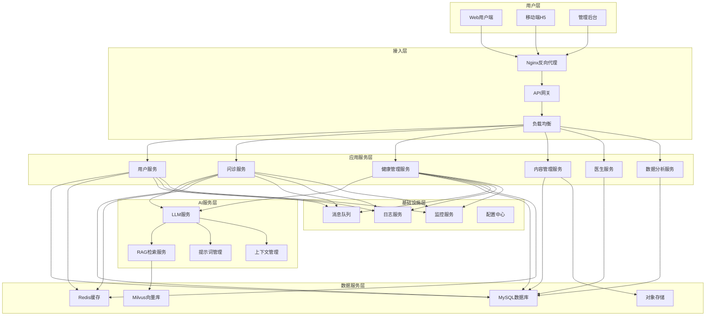

### 2.2 分层架构说明

#### 2.2.1 用户层

- **Web用户端**：面向普通用户的Web应用
- **移动端H5**：移动端响应式Web应用
- **管理后台**：面向管理员和医生的后台管理系统

#### 2.2.2 接入层

- **Nginx反向代理**：请求转发和负载均衡
- **API网关**：统一API入口，认证鉴权
- **负载均衡**：请求分发和故障转移

#### 2.2.3 应用服务层

- **用户服务**：用户管理、认证授权
- **问诊服务**：AI问诊、问诊记录管理
- **健康管理服务**：健康档案、数据分析
- **内容管理服务**：咨询文章、评论管理
- **医生服务**：医生信息、排班管理
- **数据分析服务**：数据统计、可视化

#### 2.2.4 AI服务层

- **LLM服务**：大语言模型调用
- **RAG检索服务**：知识库检索
- **提示词管理**：提示词模板管理
- **上下文管理**：对话上下文管理

#### 2.2.5 数据服务层

- **MySQL数据库**：关系型数据存储
- **Redis缓存**：缓存和会话存储
- **Milvus向量库**：向量数据存储
- **对象存储**：文件存储

#### 2.2.6 基础设施层

- **消息队列**：异步任务处理
- **日志服务**：日志收集和分析
- **监控服务**：系统监控和告警
- **配置中心**：配置管理

---

## 3. 模块设计

### 3.1 用户管理模块

#### 3.1.1 模块职责

- 用户注册、登录、认证
- 用户信息管理
- 权限管理（RBAC）
- 角色管理

#### 3.1.2 模块结构

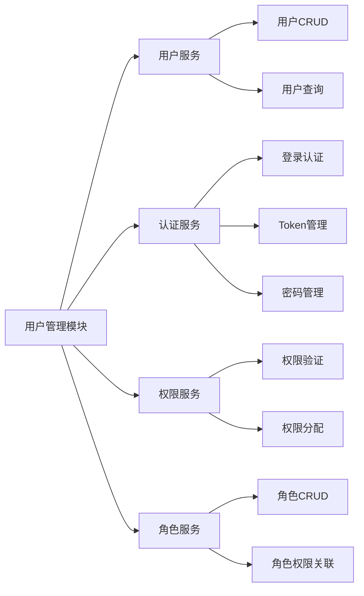

#### 3.1.3 核心类设计

```python
# 用户模型
class User(Base):
    user_id: int
    username: str
    phone: str
    email: str
    password_hash: str
    status: int
    roles: List[Role]

# 用户服务
class UserService:
    def create_user(self, user_data: UserCreate) -> User
    def get_user(self, user_id: int) -> User
    def update_user(self, user_id: int, user_data: UserUpdate) -> User
    def delete_user(self, user_id: int) -> bool
    def authenticate(self, credentials: LoginCredentials) -> Token

# 权限服务
class PermissionService:
    def check_permission(self, user: User, resource: str, action: str) -> bool
    def get_user_permissions(self, user_id: int) -> List[Permission]
```

### 3.2 问诊服务模块

#### 3.2.1 模块职责

- AI智能问诊
- 问诊记录管理
- 问诊报告生成
- 问诊上下文管理

#### 3.2.2 模块结构

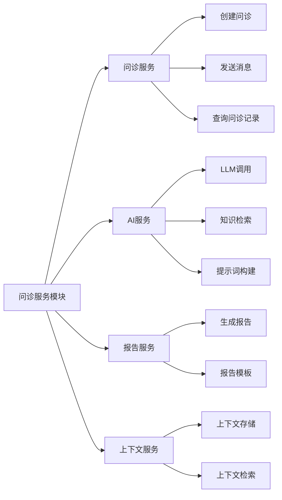

#### 3.2.3 核心类设计

```python
# 问诊记录模型
class ConsultationRecord(Base):
    consultation_id: int
    user_id: int
    symptoms: str
    conversation_history: List[Message]
    ai_suggestion: str
    status: int

# 问诊服务
class ConsultationService:
    def create_consultation(self, user_id: int) -> ConsultationRecord
    def send_message(self, consultation_id: int, message: str) -> Message
    def get_consultation(self, consultation_id: int) -> ConsultationRecord
    def get_user_consultations(self, user_id: int) -> List[ConsultationRecord]

# AI服务
class AIService:
    def chat(self, messages: List[Message], context: Dict) -> str
    def generate_suggestion(self, consultation: ConsultationRecord) -> str
    def retrieve_knowledge(self, query: str) -> List[Document]
```

### 3.3 健康管理模块

#### 3.3.1 模块职责

- 健康档案管理
- 体征数据管理
- 健康数据分析
- 疫苗接种管理
- 用药记录管理

#### 3.3.2 模块结构

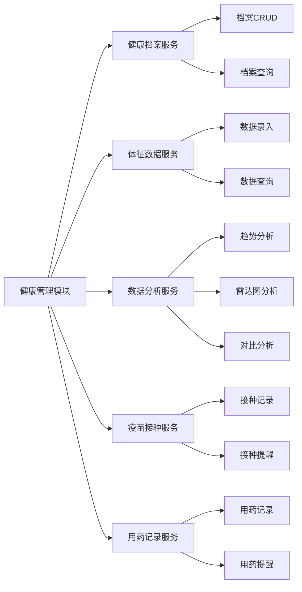

#### 3.3.3 核心类设计

```python
# 健康档案模型
class HealthRecord(Base):
    record_id: int
    user_id: int
    blood_type: str
    height: float
    weight: float
    medical_history: str
    family_history: str
    allergy_history: str

# 体征数据模型
class VitalSigns(Base):
    sign_id: int
    user_id: int
    sign_type: str  # 血压、心率、体温等
    value: float
    measured_at: datetime

# 健康档案服务
class HealthRecordService:
    def get_health_record(self, user_id: int) -> HealthRecord
    def update_health_record(self, user_id: int, data: HealthRecordUpdate) -> HealthRecord
    def add_vital_signs(self, user_id: int, signs: VitalSignsCreate) -> VitalSigns
    def get_vital_signs_trend(self, user_id: int, sign_type: str, time_range: TimeRange) -> List[VitalSigns]

# 数据分析服务
class HealthAnalysisService:
    def analyze_trend(self, user_id: int, sign_type: str, time_range: TimeRange) -> TrendAnalysis
    def generate_radar_chart(self, user_id: int) -> RadarChartData
    def compare_examination(self, user_id: int, examination_type: str) -> ComparisonResult
```

### 3.4 内容管理模块

#### 3.4.1 模块职责

- 咨询文章管理
- 分类管理
- 评论管理
- 内容审核

#### 3.4.2 模块结构

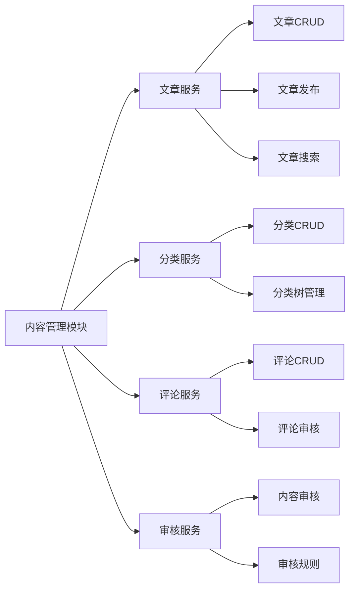

#### 3.4.3 核心类设计

```python
# 文章模型
class Article(Base):
    article_id: int
    title: str
    content: str
    category_id: int
    author_id: int
    status: int  # 草稿、待审核、已发布、已下架
    published_at: datetime

# 文章服务
class ArticleService:
    def create_article(self, article_data: ArticleCreate) -> Article
    def update_article(self, article_id: int, article_data: ArticleUpdate) -> Article
    def publish_article(self, article_id: int) -> Article
    def get_article(self, article_id: int) -> Article
    def search_articles(self, query: str, filters: ArticleFilters) -> List[Article]

# 审核服务
class ReviewService:
    def submit_for_review(self, article_id: int) -> Review
    def review_article(self, review_id: int, result: ReviewResult) -> Review
    def get_pending_reviews(self) -> List[Review]
```

### 3.5 医生管理模块

#### 3.5.1 模块职责

- 医生信息管理
- 排班管理
- 问诊记录管理

#### 3.5.2 模块结构

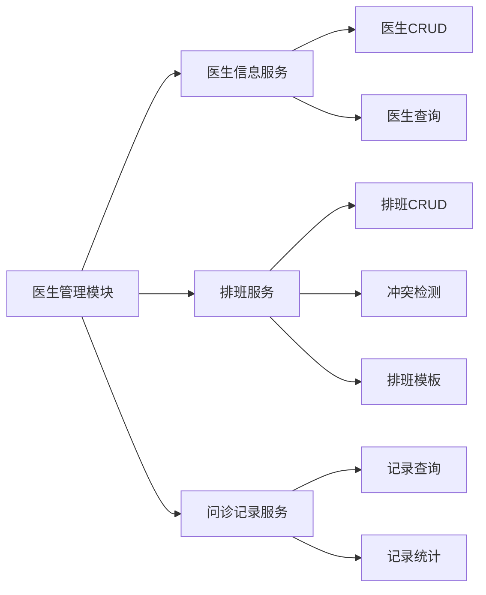

#### 3.5.3 核心类设计

```python
# 医生模型
class Doctor(Base):
    doctor_id: int
    name: str
    department: str
    title: str
    specialties: str
    certificate_url: str

# 排班模型
class Schedule(Base):
    schedule_id: int
    doctor_id: int
    date: date
    start_time: time
    end_time: time
    status: int

# 医生服务
class DoctorService:
    def create_doctor(self, doctor_data: DoctorCreate) -> Doctor
    def get_doctor(self, doctor_id: int) -> Doctor
    def update_doctor(self, doctor_id: int, doctor_data: DoctorUpdate) -> Doctor
    def create_schedule(self, schedule_data: ScheduleCreate) -> Schedule
    def check_schedule_conflict(self, doctor_id: int, date: date, time_range: TimeRange) -> bool
```

---

## 4. 数据模型设计

### 4.1 核心实体关系

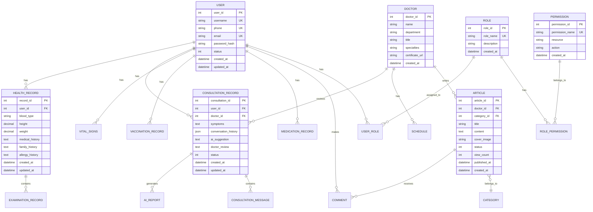

### 4.2 数据表设计

#### 4.2.1 用户相关表

**users（用户表）**
- user_id (PK)
- username (UK)
- phone (UK)
- email (UK)
- password_hash
- avatar_url
- status
- created_at
- updated_at

**roles（角色表）**
- role_id (PK)
- role_name (UK)
- description
- created_at

**permissions（权限表）**
- permission_id (PK)
- permission_name (UK)
- resource
- action
- created_at

**user_roles（用户角色关联表）**
- user_id (FK)
- role_id (FK)
- created_at

**role_permissions（角色权限关联表）**
- role_id (FK)
- permission_id (FK)
- created_at

#### 4.2.2 问诊相关表

**consultation_records（问诊记录表）**
- consultation_id (PK)
- user_id (FK)
- doctor_id (FK)
- symptoms
- conversation_history (JSON)
- ai_suggestion
- doctor_review
- status
- created_at
- updated_at

**consultation_messages（问诊消息表）**
- message_id (PK)
- consultation_id (FK)
- sender_type (user/ai)
- content
- created_at

**ai_reports（AI报告表）**
- report_id (PK)
- consultation_id (FK)
- report_content (JSON)
- report_file_url
- created_at

#### 4.2.3 健康相关表

**health_records（健康档案表）**
- record_id (PK)
- user_id (FK)
- blood_type
- height
- weight
- medical_history
- family_history
- allergy_history
- created_at
- updated_at

**vital_signs（体征数据表）**
- sign_id (PK)
- user_id (FK)
- sign_type
- value
- unit
- measured_at
- created_at

**examination_records（检查记录表）**
- examination_id (PK)
- user_id (FK)
- examination_type
- examination_data (JSON)
- examination_date
- created_at

**vaccination_records（疫苗接种记录表）**
- vaccination_id (PK)
- user_id (FK)
- vaccine_name
- vaccination_date
- vaccination_agency
- batch_number
- next_vaccination_date
- created_at

**medication_records（用药记录表）**
- medication_id (PK)
- user_id (FK)
- medication_name
- dosage
- frequency
- start_date
- end_date
- reminder_enabled
- created_at

#### 4.2.4 内容相关表

**categories（分类表）**
- category_id (PK)
- category_name
- parent_id (FK)
- sort_order
- status
- created_at

**articles（文章表）**
- article_id (PK)
- doctor_id (FK)
- category_id (FK)
- title
- content
- cover_image
- tags
- status
- view_count
- created_at
- published_at

**comments（评论表）**
- comment_id (PK)
- article_id (FK)
- user_id (FK)
- parent_id (FK)
- content
- status
- like_count
- created_at

**reviews（审核表）**
- review_id (PK)
- reviewable_type
- reviewable_id
- reviewer_id
- review_result
- review_comment
- created_at

---

## 5. API设计

### 5.1 RESTful API设计原则

1. **资源导向**：URL表示资源，而非操作
2. **HTTP方法**：GET、POST、PUT、DELETE
3. **状态码**：使用标准HTTP状态码
4. **版本控制**：URL中包含版本号
5. **统一响应格式**：统一的响应结构

### 5.2 API路由设计

```
/api/v1/
├── auth/
│   ├── POST /login          # 登录
│   ├── POST /register       # 注册
│   └── POST /refresh        # 刷新Token
├── users/
│   ├── GET /                # 获取用户列表
│   ├── GET /{id}            # 获取用户详情
│   ├── PUT /{id}           # 更新用户信息
│   └── DELETE /{id}         # 删除用户
├── consultations/
│   ├── POST /               # 创建问诊
│   ├── GET /                # 获取问诊列表
│   ├── GET /{id}           # 获取问诊详情
│   ├── POST /{id}/messages  # 发送消息
│   └── POST /{id}/report    # 生成报告
├── health/
│   ├── GET /records/{user_id}        # 获取健康档案
│   ├── PUT /records/{user_id}       # 更新健康档案
│   ├── POST /vital-signs             # 录入体征数据
│   ├── GET /vital-signs/trend        # 获取趋势分析
│   ├── GET /radar                    # 获取雷达图数据
│   └── GET /examination/compare      # 获取对比分析
├── articles/
│   ├── GET /                # 获取文章列表
│   ├── GET /{id}           # 获取文章详情
│   ├── POST /               # 创建文章
│   ├── PUT /{id}           # 更新文章
│   ├── POST /{id}/comments # 发表评论
│   └── GET /{id}/comments   # 获取评论列表
└── doctors/
    ├── GET /                # 获取医生列表
    ├── GET /{id}           # 获取医生详情
    ├── POST /               # 创建医生
    ├── PUT /{id}           # 更新医生信息
    └── GET /{id}/schedules  # 获取排班
```

### 5.3 统一响应格式

```json
{
  "code": 200,
  "message": "success",
  "data": {},
  "timestamp": "2024-01-01T00:00:00Z"
}
```

### 5.4 错误响应格式

```json
{
  "code": 400,
  "message": "请求参数错误",
  "errors": [
    {
      "field": "username",
      "message": "用户名不能为空"
    }
  ],
  "timestamp": "2024-01-01T00:00:00Z"
}
```

---

## 6. 安全设计

### 6.1 认证授权

#### 6.1.1 JWT认证流程

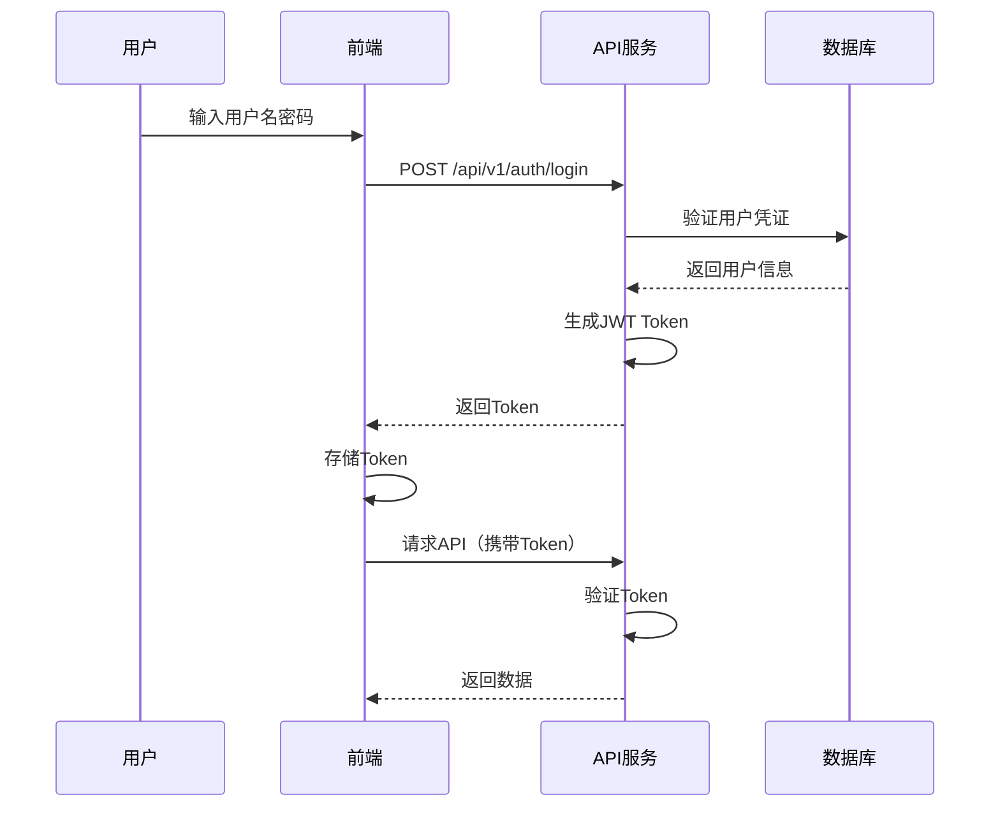

#### 6.1.2 RBAC权限模型

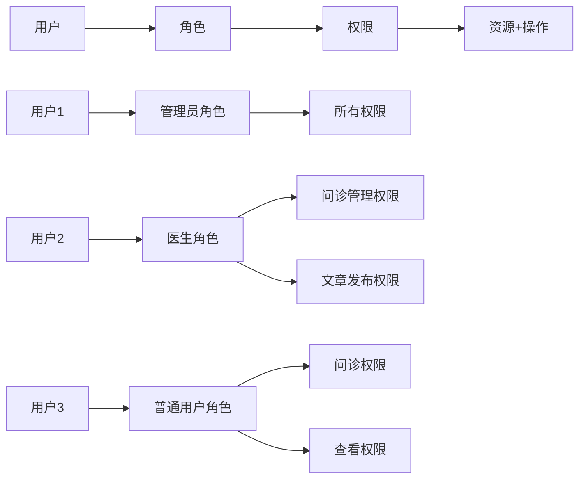

### 6.2 数据安全

1. **数据加密**：敏感数据AES-256加密存储
2. **传输加密**：HTTPS协议传输
3. **数据脱敏**：日志和展示数据脱敏
4. **访问控制**：基于角色的数据访问控制

### 6.3 API安全

1. **限流**：API请求限流
2. **防重放**：请求签名和防重放
3. **CORS**：跨域资源共享控制
4. **输入验证**：严格的输入验证和过滤

---

## 7. 性能设计

### 7.1 缓存策略

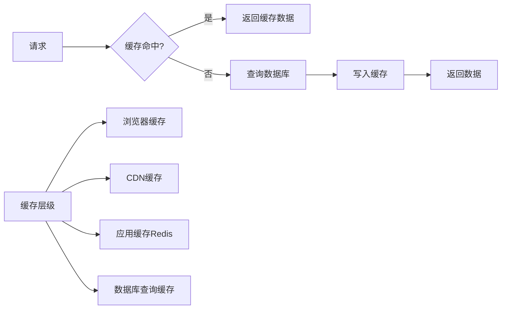

### 7.2 数据库优化

1. **索引优化**：合理创建索引
2. **查询优化**：优化SQL查询
3. **分页查询**：大数据量分页
4. **读写分离**：主从复制，读写分离

### 7.3 异步处理

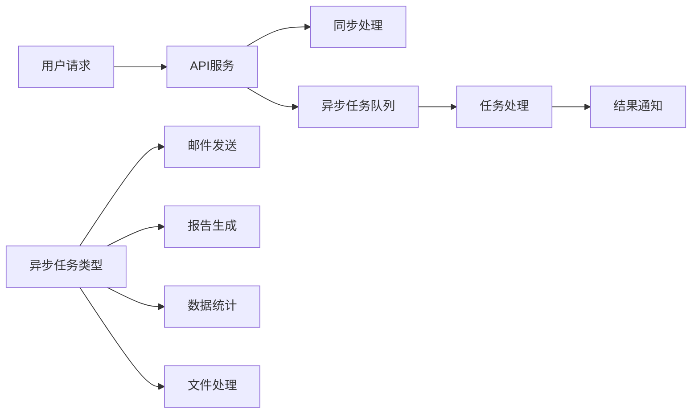

---

## 8. 部署设计

### 8.1 部署架构

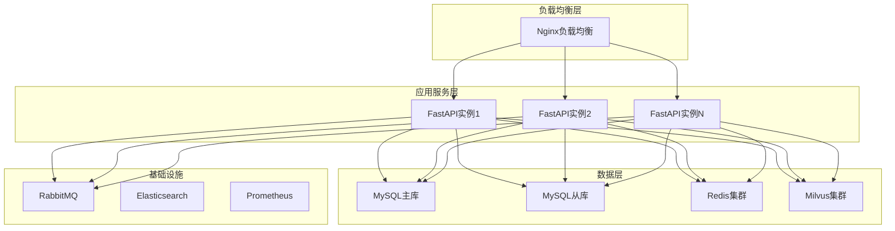

### 8.2 容器化部署

```yaml
# docker-compose.yml 示例结构
version: '3.8'
services:
  frontend:
    image: medical-frontend:latest
    ports:
      - "80:80"
  
  backend:
    image: medical-backend:latest
    ports:
      - "8000:8000"
    environment:
      - DATABASE_URL=mysql://...
      - REDIS_URL=redis://...
  
  mysql:
    image: mysql:8.0
    volumes:
      - mysql_data:/var/lib/mysql
  
  redis:
    image: redis:7.0
    volumes:
      - redis_data:/data
```

---

## 9. 监控设计

### 9.1 监控指标

1. **系统指标**：CPU、内存、磁盘、网络
2. **应用指标**：请求量、响应时间、错误率
3. **业务指标**：用户数、问诊量、文章阅读量
4. **AI指标**：LLM调用量、响应时间、成本

### 9.2 告警规则

1. **系统告警**：CPU > 80%、内存 > 85%
2. **应用告警**：错误率 > 5%、响应时间 > 3s
3. **业务告警**：异常登录、大量失败请求

---

## 10. 设计总结

### 10.1 设计亮点

1. **模块化设计**：清晰的模块划分，职责明确
2. **可扩展性**：支持水平扩展和功能扩展
3. **安全性**：完善的安全机制
4. **性能优化**：多层次的缓存和优化策略

### 10.2 后续工作

1. **详细设计**：各模块的详细设计
2. **接口设计**：完整的API接口设计
3. **数据库设计**：详细的数据库表设计
4. **测试设计**：测试方案和用例设计


