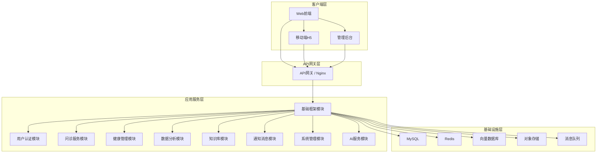
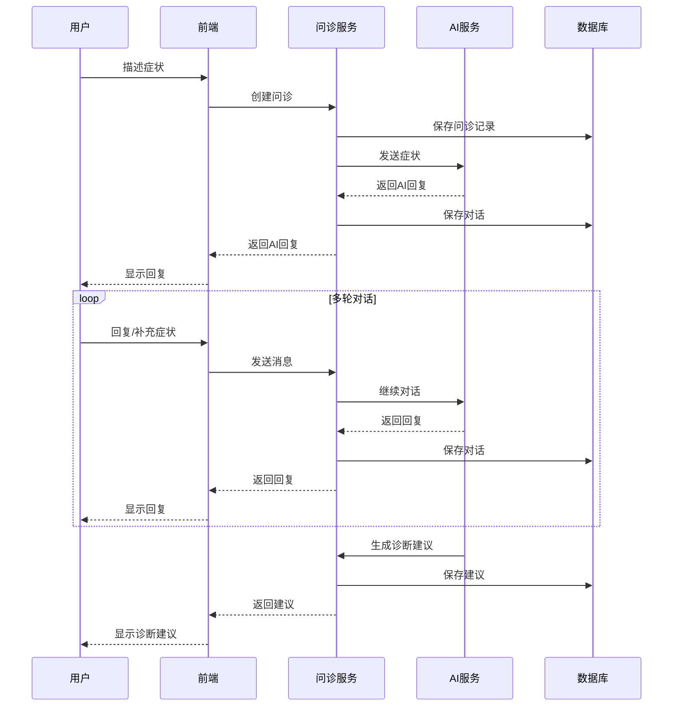
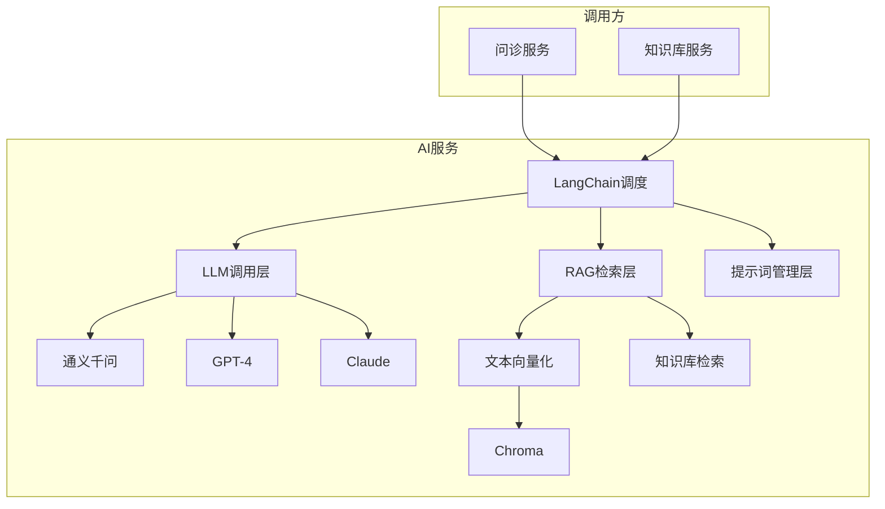
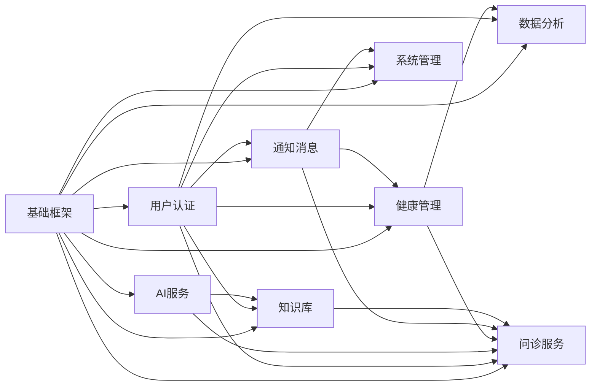

# 基于大语言模型的医疗智能体系统 - 项目模块拆分文档

## 文档信息

| 项目 | 内容 |
|------|------|
| 文档名称 | 项目模块拆分及开发计划文档 |
| 文档版本 | V1.0 |
| 编写日期 | 2026年2月 |
| 文档状态 | 初稿 |

---

## 1. 模块拆分概述

### 1.1 拆分原则

1. **功能内聚**：每个模块专注于特定业务领域
2. **独立可开发**：模块之间低耦合，可独立开发测试
3. **边界清晰**：模块职责明确，减少交叉依赖
4. **便于维护**：利于后续功能扩展和问题定位
5. **粒度合理**：避免模块过细或过粗

### 1.2 模块架构图



---

## 2. 模块详细说明

### 2.1 模块一：基础框架模块（Framework）

#### 2.1.1 模块概述

基础框架模块是整个系统的技术底座，提供公共组件、工具类和基础设施支持。

#### 2.1.2 包含功能

| 功能点 | 功能描述 | 优先级 |
|--------|----------|--------|
| 项目脚手架 | 初始化前后端项目结构 | P0 |
| 配置管理 | 统一配置管理（环境变量、配置文件） | P0 |
| 日志系统 | 统一日志记录（操作日志、错误日志） | P0 |
| 异常处理 | 全局异常捕获和处理 | P0 |
| 工具函数 | 通用工具函数（日期、字符串、加密等） | P1 |
| 公共组件 | 通用组件（分页、表格、表单等） | P1 |
| 常量定义 | 统一常量定义（状态、类型等） | P1 |
| 基础实体 | 基础实体类和DTO定义 | P0 |

#### 2.1.3 技术实现

- **后端**：FastAPI + SQLAlchemy + Pydantic
- **前端**：Vue 3 + Vite + Element Plus
- **目录结构**：

```
backend/
├── app/
│   ├── core/           # 核心配置
│   │   ├── config.py   # 配置管理
│   │   ├── security.py # 安全工具
│   │   └── logging.py  # 日志配置
│   ├── utils/          # 工具函数
│   │   ├── date_utils.py
│   │   ├── encrypt_utils.py
│   │   └── validators.py
│   ├── schemas/       # Pydantic模型
│   │   └── base.py     # 基础模型
│   └── exceptions/     # 自定义异常
│       └── base.py
└── requirements.txt

frontend/
├── src/
│   ├── core/           # 核心配置
│   │   ├── config.ts
│   │   └── utils.ts
│   ├── common/        # 公共组件
│   │   ├── Pagination.vue
│   │   └── SearchForm.vue
│   ├── composables/    # 组合式函数
│   └── types/         # TypeScript类型
└── vite.config.ts
```

#### 2.1.4 依赖关系

- 无外部依赖（其他模块依赖此模块）

#### 2.1.5 开发工作量估算

| 功能点 | 工作量（人天） |
|--------|---------------|
| 项目初始化 | 1 |
| 配置管理 | 1 |
| 日志系统 | 1 |
| 异常处理 | 0.5 |
| 工具函数 | 1.5 |
| 公共组件 | 2 |
| 合计 | **7** |

---

### 2.2 模块二：用户认证模块（Auth）

#### 2.2.1 模块概述

用户认证模块负责用户的注册、登录、权限验证等认证授权功能。

#### 2.2.2 包含功能

| 功能点 | 功能描述 | 优先级 |
|--------|----------|--------|
| 用户注册 | 手机号/邮箱注册 | P0 |
| 用户登录 | 账号密码/验证码登录 | P0 |
| Token管理 | JWT Token生成和刷新 | P0 |
| 第三方登录 | 微信登录 | P1 |
| 密码管理 | 找回密码、修改密码 | P1 |
| 权限验证 | 基于RBAC的权限验证 | P0 |
| 角色管理 | 角色CRUD、权限分配 | P1 |
| 登录日志 | 记录登录历史 | P1 |

#### 2.2.3 数据模型

```python
# 核心模型
class User(Base):
    user_id, username, phone, email, password_hash, avatar_url, status

class Role(Base):
    role_id, role_name, description, status

class Permission(Base):
    permission_id, permission_name, resource, action

class UserRole(Base):
    user_id, role_id

class RolePermission(Base):
    role_id, permission_id
```

#### 2.2.4 API接口

| 接口 | 方法 | 说明 |
|------|------|------|
| /api/v1/auth/register | POST | 用户注册 |
| /api/v1/auth/login | POST | 用户登录 |
| /api/v1/auth/logout | POST | 用户登出 |
| /api/v1/auth/refresh-token | POST | 刷新Token |
| /api/v1/auth/send-code | POST | 发送验证码 |
| /api/v1/auth/reset-password | POST | 重置密码 |
| /api/v1/roles | CRUD | 角色管理 |
| /api/v1/permissions | CRUD | 权限管理 |

#### 2.2.5 前端页面

| 页面 | 路由 | 说明 |
|------|------|------|
| 登录页 | /login | 用户登录 |
| 注册页 | /register | 用户注册 |
| 忘记密码 | /forgot-password | 找回密码 |
| 用户中心 | /profile | 个人中心 |

#### 2.2.6 依赖关系

- 依赖模块：基础框架模块
- 被依赖模块：所有业务模块

#### 2.2.7 开发工作量估算

| 功能点 | 工作量（人天） |
|--------|---------------|
| 用户注册/登录 | 2 |
| Token管理 | 1.5 |
| 权限验证 | 2 |
| 角色管理 | 1.5 |
| 登录日志 | 1 |
| 前端页面 | 2 |
| 合计 | **10** |

---

### 2.3 模块三：问诊服务模块（Consultation）

#### 2.3.1 模块概述

问诊服务模块是系统的核心业务模块，提供AI智能问诊、医生审核、报告生成等功能。

#### 2.3.2 包含功能

| 功能点 | 功能描述 | 优先级 |
|--------|----------|--------|
| 创建问诊 | 创建新的问诊会话 | P0 |
| 智能对话 | AI多轮对话问诊 | P0 |
| 症状理解 | 自然语言症状理解 | P0 |
| 追问生成 | AI根据症状追问 | P0 |
| 诊断建议 | AI生成诊断建议 | P0 |
| 报告生成 | 生成图文报告（PDF） | P1 |
| 问诊历史 | 查看历史问诊记录 | P0 |
| 医生审核 | 医生审核AI建议 | P1 |
| 紧急识别 | 识别紧急症状并告警 | P0 |
| 问诊统计 | 问诊数据统计分析 | P2 |

#### 2.3.3 数据模型

```python
# 核心模型
class ConsultationRecord(Base):
    consultation_id, user_id, doctor_id, symptoms
    conversation_history, ai_suggestion, doctor_review
    severity_level, status, created_at, updated_at

class ConsultationReport(Base):
    id, consultation_id, user_id, report_type
    content, file_url, created_at
```

#### 2.3.4 API接口

| 接口 | 方法 | 说明 |
|------|------|------|
| /api/v1/consultations | POST | 创建问诊 |
| /api/v1/consultations | GET | 问诊列表 |
| /api/v1/consultations/{id} | GET | 问诊详情 |
| /api/v1/consultations/{id}/messages | POST | 发送消息 |
| /api/v1/consultations/{id}/report | POST | 生成报告 |
| /api/v1/consultations/{id}/review | POST | 医生审核 |
| /api/v1/consultations/{id}/severity | GET | 获取严重程度 |

#### 2.3.5 前端页面

| 页面 | 路由 | 说明 |
|------|------|------|
| 问诊首页 | /consultation/index | 问诊入口 |
| 问诊对话 | /consultation/chat/:id | 问诊对话 |
| 问诊记录 | /consultation/records | 问诊历史 |
| 问诊报告 | /consultation/report/:id | 查看报告 |
| 问诊审核 | /admin/consultation/review | 医生审核 |

#### 2.3.6 核心流程



#### 2.3.7 依赖关系

- 依赖模块：基础框架模块、用户认证模块、AI服务模块
- 被依赖模块：健康管理模块（健康档案）、通知消息模块

#### 2.3.8 开发工作量估算

| 功能点 | 工作量（人天） |
|--------|---------------|
| 问诊创建/对话 | 3 |
| AI对话集成 | 4 |
| 诊断建议生成 | 2 |
| 报告生成 | 2 |
| 医生审核 | 1.5 |
| 紧急识别 | 2 |
| 前端页面 | 3 |
| 合计 | **17.5** |

---

### 2.4 模块四：健康管理模块（Health）

#### 2.4.1 模块概述

健康管理模块负责用户的健康档案、体征数据、用药记录、疫苗接种等健康信息管理。

#### 2.4.2 包含功能

| 功能点 | 功能描述 | 优先级 |
|--------|----------|--------|
| 健康档案 | 基本信息、病史管理 | P0 |
| 体征录入 | 血压、心率等体征数据录入 | P0 |
| 体征趋势 | 体征数据趋势展示 | P0 |
| 用药记录 | 用药记录管理 | P1 |
| 用药提醒 | 定时服药提醒 | P1 |
| 疫苗接种 | 疫苗接种记录 | P1 |
| 接种提醒 | 下一针接种提醒 | P2 |
| 健康分享 | 健康档案分享给医生 | P1 |

#### 2.4.3 数据模型

```python
# 核心模型
class HealthRecord(Base):
    record_id, user_id, blood_type, height, weight
    medical_history, family_history, allergy_history

class VitalSign(Base):
    id, user_id, type, value, value_ext, unit
    record_time, source, created_at

class MedicationRecord(Base):
    id, user_id, drug_name, drug_spec, dosage
    frequency, start_date, end_date, reminder_time
    is_active, prescription_id, doctor_id

class VaccinationRecord(Base):
    id, user_id, vaccine_name, vaccine_batch
    dose_number, inoculation_date, next_dose_date
```

#### 2.4.4 API接口

| 接口 | 方法 | 说明 |
|------|------|------|
| /api/v1/health/records | CRUD | 健康档案 |
| /api/v1/health/vital-signs | CRUD | 体征数据 |
| /api/v1/health/vital-signs/trend | GET | 体征趋势 |
| /api/v1/health/medications | CRUD | 用药记录 |
| /api/v1/health/medications/:id/reminder | POST | 设置提醒 |
| /api/v1/health/vaccinations | CRUD | 疫苗接种 |
| /api/v1/health/share | POST | 档案分享 |

#### 2.4.5 前端页面

| 页面 | 路由 | 说明 |
|------|------|------|
| 健康档案 | /health/record | 档案详情/编辑 |
| 体征录入 | /health/vitals/input | 体征数据录入 |
| 体征趋势 | /health/vitals/trend | 趋势图表 |
| 用药管理 | /health/medications | 用药列表 |
| 疫苗接种 | /health/vaccinations | 接种记录 |
| 档案分享 | /health/share | 分享设置 |

#### 2.4.6 依赖关系

- 依赖模块：基础框架模块、用户认证模块、通知消息模块
- 被依赖模块：问诊服务模块（获取健康档案）

#### 2.4.7 开发工作量估算

| 功能点 | 工作量（人天） |
|--------|---------------|
| 健康档案 | 2 |
| 体征管理 | 2.5 |
| 用药管理 | 2 |
| 疫苗接种 | 1.5 |
| 前端页面 | 3 |
| 合计 | **11** |

---

### 2.5 模块五：数据分析模块（Analytics）

#### 2.5.1 模块概述

数据分析模块负责健康数据的可视化分析，包括体征趋势、健康雷达图、检查指标对比等。

#### 2.5.2 包含功能

| 功能点 | 功能描述 | 优先级 |
|--------|----------|--------|
| 体征趋势分析 | 体征数据折线图展示 | P0 |
| 健康雷达图 | 多维度健康评估雷达图 | P0 |
| 检查指标对比 | 检查指标历史对比 | P1 |
| 用户访问统计 | 访问量、活跃用户统计 | P1 |
| 问诊统计 | 问诊量、疾病分布统计 | P1 |
| 医生工作量统计 | 医生接诊统计 | P2 |
| 数据导出 | 统计报表导出 | P1 |

#### 2.5.3 API接口

| 接口 | 方法 | 说明 |
|------|------|------|
| /api/v1/analytics/vital-signs/trend | GET | 体征趋势 |
| /api/v1/analytics/radar | GET | 健康雷达图 |
| /api/v1/analytics/examination/compare | GET | 检查对比 |
| /api/v1/analytics/visits | GET | 访问统计 |
| /api/v1/analytics/consultations | GET | 问诊统计 |
| /api/v1/analytics/doctors/workload | GET | 医生工作量 |
| /api/v1/analytics/export | POST | 数据导出 |

#### 2.5.4 前端页面

| 页面 | 路由 | 说明 |
|------|------|------|
| 体征趋势页 | /analytics/vitals | 趋势图表 |
| 健康雷达页 | /analytics/radar | 雷达图 |
| 检查对比页 | /analytics/examination | 指标对比 |
| 运营统计页 | /admin/analytics/operation | 运营数据 |
| 医生统计页 | /admin/analytics/doctors | 医生工作量 |

#### 2.5.5 图表配置

| 图表类型 | 适用场景 | 库 |
|----------|----------|-----|
| 折线图 | 体征趋势 | ECharts |
| 雷达图 | 健康评估 | ECharts |
| 柱状图 | 数据对比 | ECharts |
| 饼图 | 分布占比 | ECharts |
| 热力图 | 用户行为 | ECharts |

#### 2.5.6 依赖关系

- 依赖模块：基础框架模块、用户认证模块、健康管理模块
- 被依赖模块：无（提供数据分析服务）

#### 2.5.7 开发工作量估算

| 功能点 | 工作量（人天） |
|--------|---------------|
| 体征趋势 | 2 |
| 健康雷达 | 1.5 |
| 检查对比 | 1.5 |
| 运营统计 | 2 |
| 前端页面 | 2 |
| 合计 | **9** |

---

### 2.6 模块六：知识库模块（Knowledge）

#### 2.6.1 模块概述

知识库模块负责医学知识库、临床指南、药品信息的管理和检索。

#### 2.6.2 包含功能

| 功能点 | 功能描述 | 优先级 |
|--------|----------|--------|
| 知识词条管理 | 医学知识CRUD | P1 |
| 知识检索 | 关键词检索 | P0 |
| 临床指南管理 | 指南文档管理 | P2 |
| 药品信息库 | 药品信息查询 | P1 |
| 药品相互作用 | 用药安全检查 | P1 |
| 知识审核 | 知识审核工作流 | P2 |
| 知识统计 | 知识库使用统计 | P2 |

#### 2.6.3 数据模型

```python
# 核心模型
class MedicalKnowledge(Base):
    id, category_id, title, keywords, content
    source, author, status, version

class DrugInfo(Base):
    id, drug_name, generic_name, specification
    usage, indication, contraindication
    side_effect, manufacturer

class ClinicalGuide(Base):
    id, title, category, content
    version, status, published_at
```

#### 2.6.4 API接口

| 接口 | 方法 | 说明 |
|------|------|------|
| /api/v1/knowledge | CRUD | 知识管理 |
| /api/v1/knowledge/search | GET | 知识检索 |
| /api/v1/knowledge/:id/audit | POST | 知识审核 |
| /api/v1/drugs | GET | 药品列表 |
| /api/v1/drugs/:id | GET | 药品详情 |
| /api/v1/drugs/interaction | POST | 用药检查 |
| /api/v1/guides | CRUD | 指南管理 |

#### 2.6.5 前端页面

| 页面 | 路由 | 说明 |
|------|------|------|
| 知识搜索 | /knowledge/search | 知识检索 |
| 知识详情 | /knowledge/:id | 知识详情 |
| 药品查询 | /knowledge/drugs | 药品库 |
| 指南查阅 | /knowledge/guides | 临床指南 |
| 知识管理 | /admin/knowledge | 知识管理 |

#### 2.6.6 依赖关系

- 依赖模块：基础框架模块、用户认证模块
- 被依赖模块：问诊服务模块（AI问诊引用）

#### 2.6.7 开发工作量估算

| 功能点 | 工作量（人天） |
|--------|---------------|
| 知识检索 | 2 |
| 药品信息 | 1.5 |
| 指南管理 | 1 |
| 知识管理后台 | 1.5 |
| 前端页面 | 2 |
| 合计 | **8** |

---

### 2.7 模块七：通知消息模块（Notification）

#### 2.7.1 模块概述

通知消息模块负责站内消息、邮件通知、短信通知等消息推送功能。

#### 2.7.2 包含功能

| 功能点 | 功能描述 | 优先级 |
|--------|----------|--------|
| 站内消息 | 系统消息推送 | P1 |
| 消息管理 | 消息列表/已读/删除 | P1 |
| 邮件通知 | 邮件发送 | P1 |
| 短信通知 | 短信发送 | P2 |
| 推送通知 | App推送 | P2 |
| 消息模板 | 消息模板管理 | P1 |
| 消息设置 | 用户通知设置 | P1 |

#### 2.7.3 API接口

| 接口 | 方法 | 说明 |
|------|------|------|
| /api/v1/messages | GET | 消息列表 |
| /api/v1/messages/:id/read | PUT | 标记已读 |
| /api/v1/messages/unread-count | GET | 未读数量 |
| /api/v1/notifications/email | POST | 发送邮件 |
| /api/v1/notifications/sms | POST | 发送短信 |
| /api/v1/notifications/settings | CRUD | 通知设置 |

#### 2.7.4 依赖关系

- 依赖模块：基础框架模块、用户认证模块
- 被依赖模块：所有业务模块（发送通知）

#### 2.7.5 开发工作量估算

| 功能点 | 工作量（人天） |
|--------|---------------|
| 站内消息 | 1.5 |
| 邮件通知 | 1.5 |
| 短信通知 | 1 |
| 消息设置 | 1 |
| 前端页面 | 1.5 |
| 合计 | **6.5** |

---

### 2.8 模块八：系统管理模块（System）

#### 2.8.1 模块概述

系统管理模块负责系统配置、医生管理、内容管理、随访管理等运营管理功能。

#### 2.8.2 包含功能

| 功能点 | 功能描述 | 优先级 |
|--------|----------|--------|
| 医生管理 | 医生信息CRUD | P0 |
| 医生排班 | 排班管理 | P1 |
| 文章管理 | 健康咨询文章CRUD | P0 |
| 文章审核 | 文章审核工作流 | P0 |
| 评论管理 | 评论审核/回复 | P1 |
| 分类管理 | 文章分类管理 | P1 |
| 系统配置 | 系统参数配置 | P1 |
| 随访管理 | 随访计划/记录 | P1 |
| 告警管理 | 紧急告警处理 | P0 |
| 数据备份 | 数据备份/恢复 | P2 |

#### 2.8.3 数据模型

```python
# 核心模型
class Doctor(Base):
    doctor_id, name, gender, age, department
    title, specialties, certificate_url, introduction

class Schedule(Base):
    id, doctor_id, date, time_slot, status

class Article(Base):
    article_id, doctor_id, category_id, title
    content, cover_image, tags, status, view_count

class ArticleCategory(Base):
    id, name, parent_id, level, sort_order

class Comment(Base):
    id, article_id, user_id, content
    status, like_count, parent_id

class FollowUpPlan(Base):
    id, user_id, doctor_id, consultation_id
    plan_type, frequency, start_date, content_template

class FollowUpRecord(Base):
    id, plan_id, user_id, execute_type
    content, result, satisfaction

class AlertRecord(Base):
    id, user_id, alert_type, severity, title
    content, status, contact_notified
```

#### 2.8.4 API接口

| 接口 | 方法 | 说明 |
|------|------|------|
| /api/v1/doctors | CRUD | 医生管理 |
| /api/v1/doctors/:id/schedule | CRUD | 排班管理 |
| /api/v1/articles | CRUD | 文章管理 |
| /api/v1/articles/:id/audit | POST | 文章审核 |
| /api/v1/comments | CRUD | 评论管理 |
| /api/v1/categories | CRUD | 分类管理 |
| /api/v1/system/config | CRUD | 系统配置 |
| /api/v1/followup/plans | CRUD | 随访计划 |
| /api/v1/followup/records | CRUD | 随访记录 |
| /api/v1/alerts | CRUD | 告警管理 |

#### 2.8.5 前端页面

| 页面 | 路由 | 说明 |
|------|------|------|
| 医生管理 | /admin/doctors | 医生列表 |
| 医生排班 | /admin/schedule | 排班管理 |
| 文章管理 | /admin/articles | 文章列表 |
| 文章审核 | /admin/articles/audit | 审核列表 |
| 评论管理 | /admin/comments | 评论管理 |
| 分类管理 | /admin/categories | 分类管理 |
| 系统配置 | /admin/config | 系统配置 |
| 随访管理 | /admin/followup | 随访管理 |
| 告警处理 | /admin/alerts | 告警列表 |

#### 2.8.6 依赖关系

- 依赖模块：基础框架模块、用户认证模块、通知消息模块
- 被依赖模块：无（业务管理后台）

#### 2.8.7 开发工作量估算

| 功能点 | 工作量（人天） |
|--------|---------------|
| 医生管理 | 1.5 |
| 排班管理 | 1.5 |
| 文章管理 | 2 |
| 评论管理 | 1 |
| 随访管理 | 2 |
| 告警管理 | 1.5 |
| 系统配置 | 1 |
| 前端页面 | 3.5 |
| 合计 | **14** |

---

### 2.9 模块九：AI服务模块（AI Service）

#### 2.9.1 模块概述

AI服务模块是系统的人工智能核心，提供大语言模型调用、RAG检索、提示词管理等AI能力。

#### 2.9.2 包含功能

| 功能点 | 功能描述 | 优先级 |
|--------|----------|--------|
| LLM调用 | 通义千问/GPT调用 | P0 |
| 模型切换 | 多模型切换 | P1 |
| 提示词管理 | 问诊提示词配置 | P0 |
| 上下文管理 | 会话上下文管理 | P0 |
| RAG检索 | 知识库检索增强 | P0 |
| 向量存储 | Chroma向量存储 | P0 |
| 文本向量化 | 文本embedding | P0 |
| 结果缓存 | AI结果缓存 | P1 |
| 调用统计 | AI调用统计分析 | P2 |

#### 2.9.3 架构设计



#### 2.9.4 核心代码结构

```python
# AI服务核心
class AIService:
    def chat(self, messages, context):
        # 构建提示词
        prompt = self.build_prompt(messages, context)
        # 检索知识
        knowledge = self.retrieve_knowledge(messages)
        # 调用LLM
        response = self.llm.invoke(prompt, knowledge)
        return response
    
    def retrieve_knowledge(self, query):
        # 文本向量化
        embedding = self.embedding_model.encode(query)
        # 向量检索
        results = self.vector_db.search(embedding)
        return results
```

#### 2.9.5 依赖关系

- 依赖模块：基础框架模块、知识库模块
- 被依赖模块：问诊服务模块

#### 2.9.6 开发工作量估算

| 功能点 | 工作量（人天） |
|--------|---------------|
| LLM调用封装 | 2 |
| 提示词管理 | 1.5 |
| RAG检索 | 3 |
| 向量存储 | 2 |
| 模型切换 | 1 |
| 调用统计 | 1 |
| 合计 | **10.5** |

---

## 3. 模块依赖关系图



---

## 4. 开发优先级排序

### 4.1 第一阶段：基础架构（4周）

| 序号 | 模块 | 周期 | 累计 |
|------|------|------|------|
| 1 | 基础框架 | 2周 | 2周 |
| 2 | 用户认证 | 2周 | 4周 |

**里程碑**：完成项目基础框架搭建，实现用户注册登录功能。

### 4.2 第二阶段：核心业务（6周）

| 序号 | 模块 | 周期 | 累计 |
|------|------|------|------|
| 3 | AI服务 | 2周 | 6周 |
| 4 | 问诊服务 | 2.5周 | 8.5周 |
| 5 | 健康管理 | 1.5周 | 10周 |

**里程碑**：完成AI问诊核心功能，用户可以进行智能问诊。

### 4.3 第三阶段：功能完善（4周）

| 序号 | 模块 | 周期 | 累计 |
|------|------|------|------|
| 6 | 数据分析 | 1.5周 | 11.5周 |
| 7 | 知识库 | 1.5周 | 13周 |
| 8 | 通知消息 | 1周 | 14周 |

**里程碑**：完成健康数据分析和知识库功能。

### 4.4 第四阶段：管理功能（3周）

| 序号 | 模块 | 周期 | 累计 |
|------|------|------|------|
| 9 | 系统管理 | 2周 | 16周 |
| 10 | 优化测试 | 1周 | 17周 |

**里程碑**：完成所有功能，进入测试优化阶段。

---

## 5. 工作量汇总

| 模块 | 功能点数 | 工作量（人天） |
|------|----------|---------------|
| 基础框架 | 8 | 7 |
| 用户认证 | 8 | 10 |
| 问诊服务 | 10 | 17.5 |
| 健康管理 | 8 | 11 |
| 数据分析 | 7 | 9 |
| 知识库 | 7 | 8 |
| 通知消息 | 7 | 6.5 |
| 系统管理 | 10 | 14 |
| AI服务 | 9 | 10.5 |
| **合计** | **74** | **83** |

---

## 6. 开发团队配置建议

### 6.1 人员配置

| 角色 | 数量 | 主要职责 |
|------|------|----------|
| 后端开发 | 2人 | 负责后端API开发 |
| 前端开发 | 2人 | 负责前端页面开发 |
| AI工程师 | 1人 | 负责AI服务开发 |
| 测试工程师 | 1人 | 负责功能测试 |
| 项目经理 | 1人 | 负责项目协调 |

### 6.2 总工作量

- **总人天**：83人天
- **预估周期**：17周（约4个月）
- **总人力**：6人

---

## 7. 模块接口清单

### 7.1 模块间调用关系

| 调用方 | 提供方 | 接口 | 说明 |
|--------|--------|------|------|
| 问诊服务 | 用户认证 | /api/v1/auth/verify | 验证Token |
| 问诊服务 | AI服务 | internal/ai/chat | AI对话 |
| 问诊服务 | 健康管理 | /api/v1/health/records | 获取健康档案 |
| 问诊服务 | 通知消息 | internal/notify/send | 发送通知 |
| 数据分析 | 健康管理 | /api/v1/health/vital-signs | 获取体征数据 |
| 知识库 | AI服务 | internal/ai/embedding | 文本向量化 |

### 7.2 内部接口定义

```python
# 内部服务调用示例（不通过HTTP）
class AIService:
    async def chat(self, request: ChatRequest) -> ChatResponse:
        """AI对话服务"""
        pass
    
    async def embed_texts(self, texts: List[str]) -> List[List[float]]:
        """文本向量化"""
        pass

class NotificationService:
    async def sendNotification(self, user_id: int, template: str, data: dict):
        """发送通知"""
        pass
```

---

## 8. 附录

### 8.1 技术栈清单

| 层级 | 技术 | 版本 |
|------|------|------|
| 前端框架 | Vue.js | 3.4.x |
| UI组件 | Element Plus | 2.x |
| 状态管理 | Pinia | 2.x |
| 图表库 | ECharts | 5.x |
| 构建工具 | Vite | 5.x |
| 后端框架 | FastAPI | 0.104.x |
| ORM | SQLAlchemy | 2.0.x |
| 数据库 | MySQL | 8.0.x |
| 缓存 | Redis | 7.0.x |
| 向量库 | Chroma | 0.4.x |
| AI框架 | LangChain | 0.1.x |
| LLM | 通义千问 | - |

### 8.2 数据库资源

| 数据库 | 用途 | 字符集 |
|--------|------|--------|
| medical_ai | 主数据库 | utf8mb4 |
| medical_ai_cache | 缓存数据库 | - |
| medical_ai_vector | 向量数据库 | - |

### 8.3 环境配置

| 环境 | 用途 | URL |
|------|------|-----|
| 开发环境 | 本地开发 | http://localhost:3000 |
| 测试环境 | 集成测试 | http://test.medical-ai.com |
| 生产环境 | 正式上线 | https://medical-ai.com |

---

## 9. 总结

本文档将医疗智能体系统拆分为9个独立模块，每个模块都具有清晰的职责边界和独立开发能力。按照开发优先级排序，总工作量约83人天，预计开发周期17周（约4个月）。

模块化开发可以有效降低开发复杂度，提高代码可维护性，便于后续功能扩展和团队协作。
