# 基于大语言模型的医疗智能体系统 - 项目流程图

## 文档信息

| 项目 | 内容 |
|------|------|
| 文档名称 | 基于大语言模型的医疗智能体系统项目流程图 |
| 文档版本 | V1.0 |
| 编写日期 | 2025年 |
| 文档状态 | 正式版 |

---

## 1. 业务流程图

### 1.1 用户注册登录流程

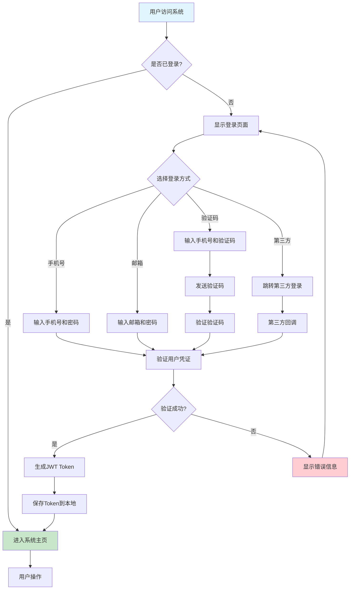

### 1.2 AI智能问诊流程

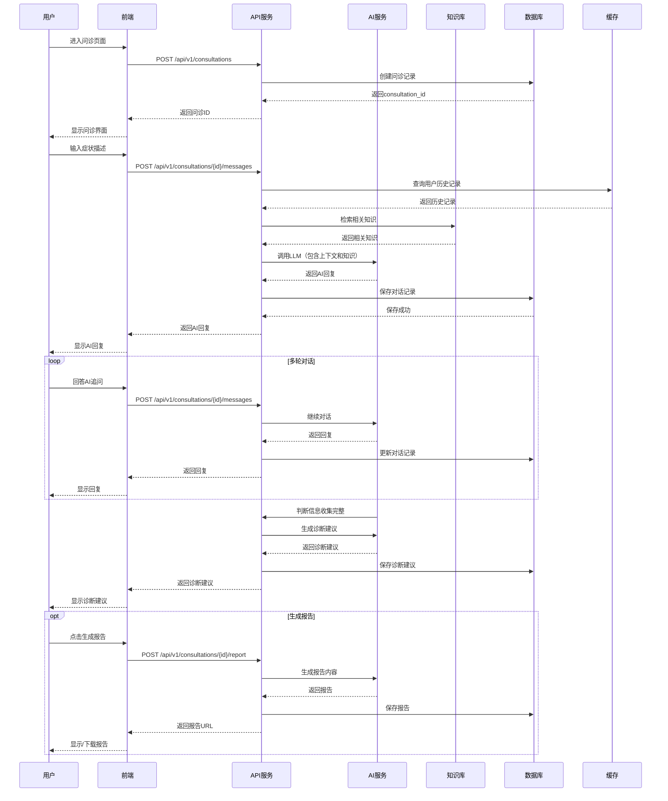

### 1.3 健康数据分析流程

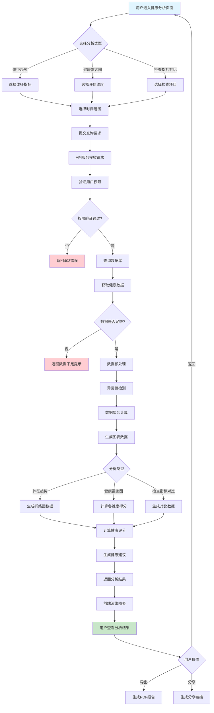

### 1.4 内容审核流程

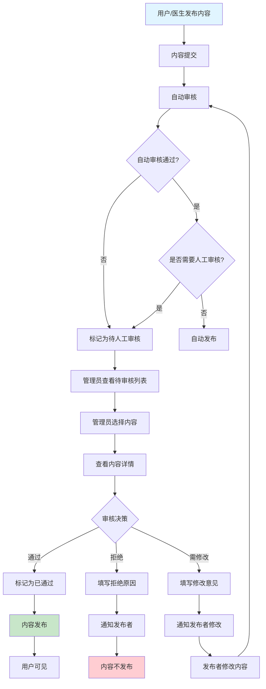

### 1.5 医生审核问诊记录流程

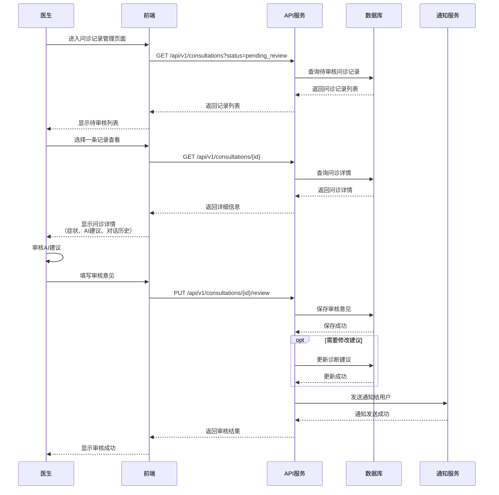

---

## 2. 系统流程图

### 2.1 系统启动流程

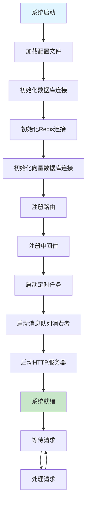

### 2.2 API请求处理流程

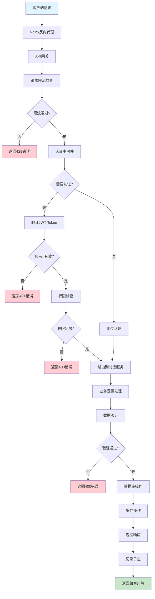

### 2.3 异步任务处理流程

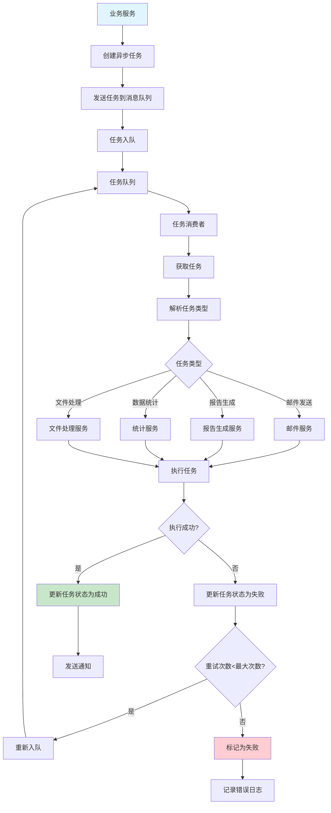

### 2.4 缓存更新流程

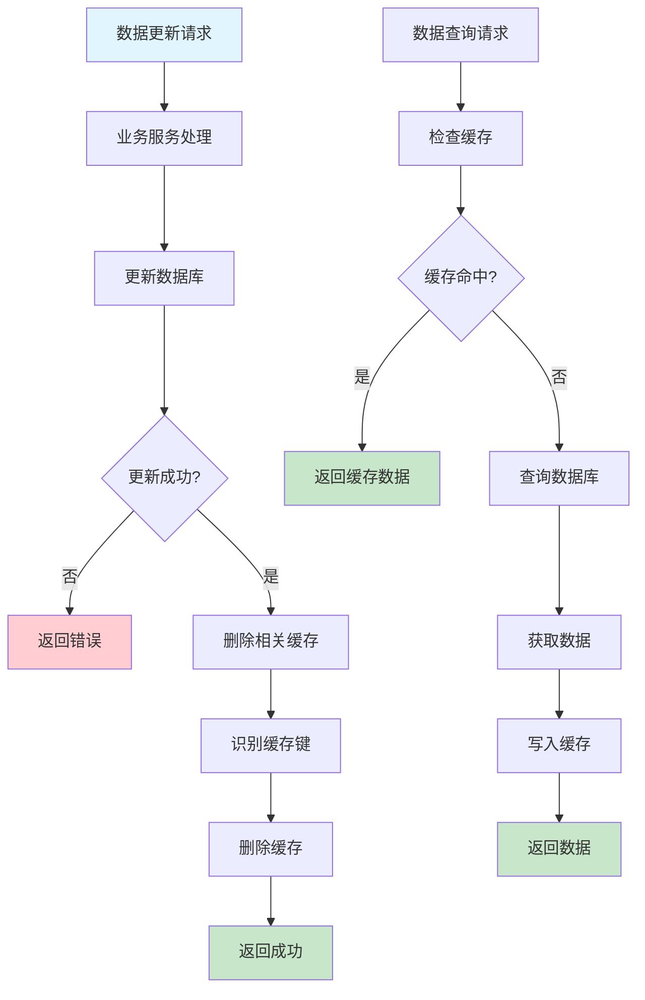

---

## 3. 数据流程图

### 3.1 问诊数据流

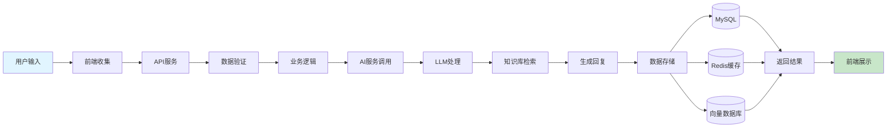

### 3.2 健康数据流

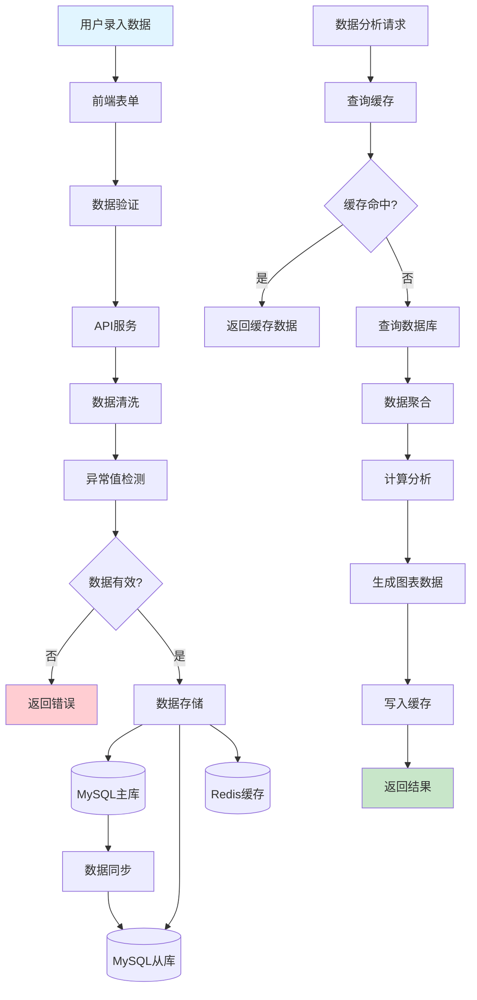

### 3.3 文件上传数据流

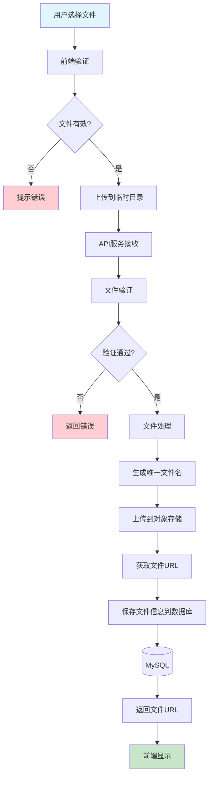

---

## 4. 系统交互流程图

### 4.1 前后端交互流程

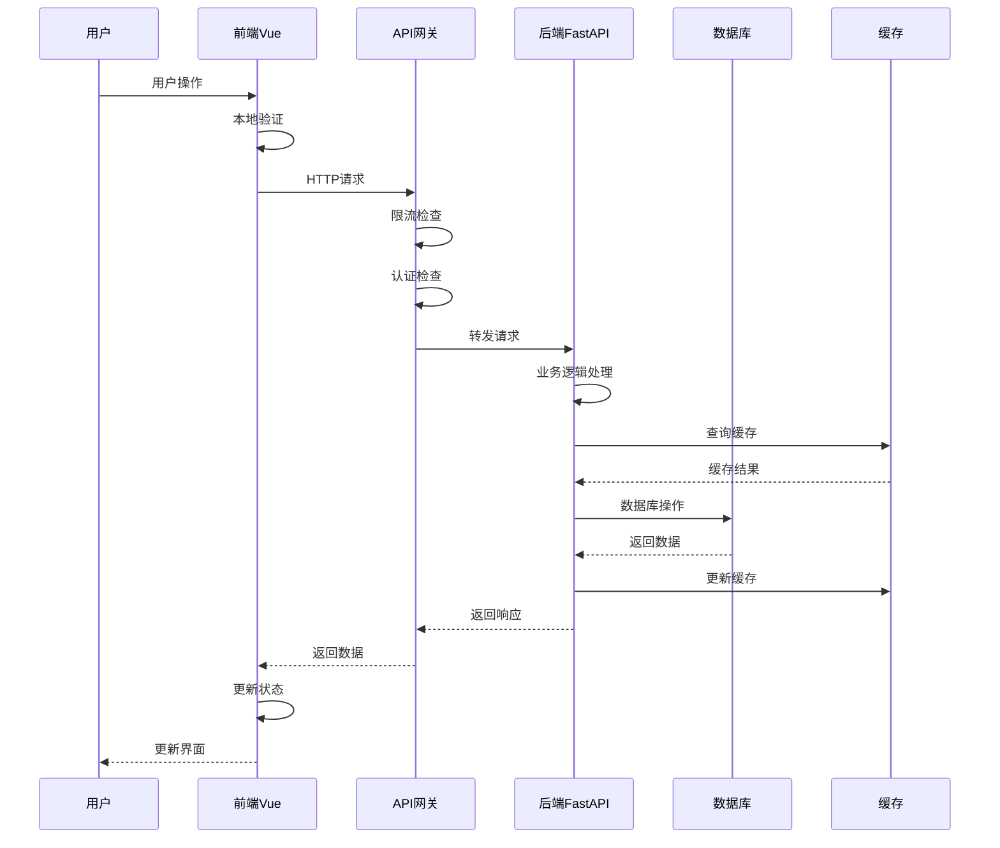

### 4.2 AI服务调用流程

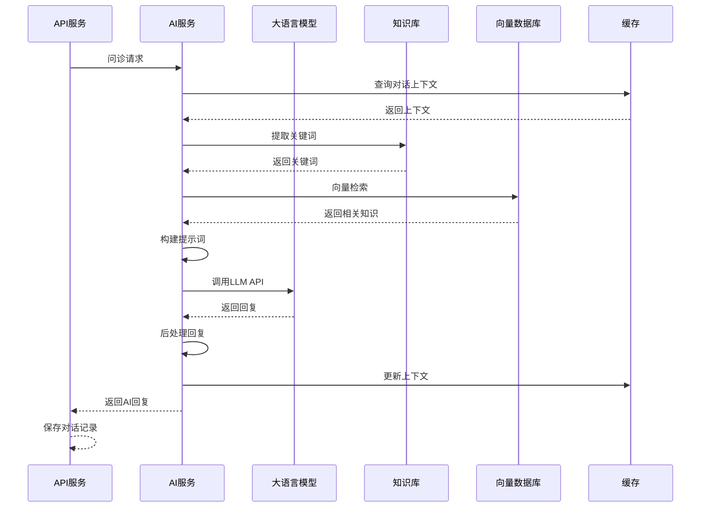

### 4.3 权限验证流程

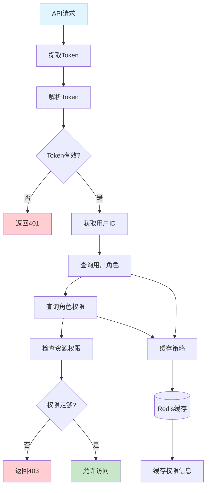

---

## 5. 错误处理流程

### 5.1 错误处理机制

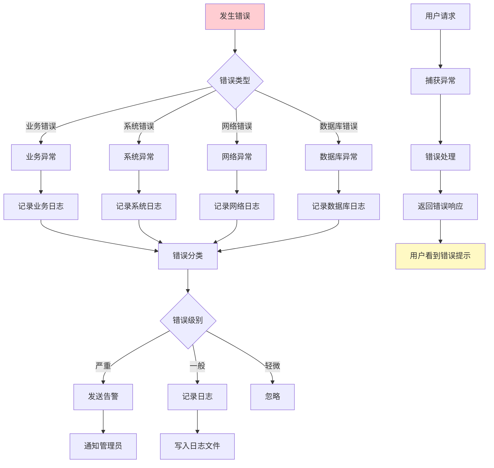

---

## 6. 部署流程图

### 6.1 CI/CD流程

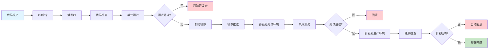

---

## 7. 监控告警流程

### 7.1 监控数据采集流程

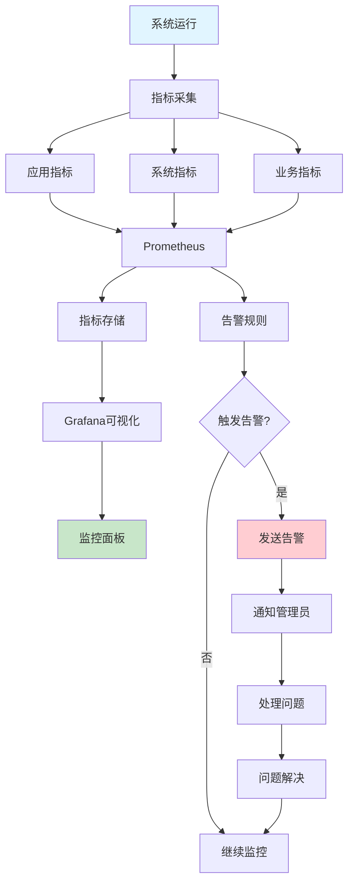

---

## 8. 流程图总结

### 8.1 核心流程

1. **用户注册登录流程**：用户身份认证和授权
2. **AI智能问诊流程**：核心业务功能，多轮对话和知识检索
3. **健康数据分析流程**：数据查询、分析和可视化
4. **内容审核流程**：自动审核和人工审核结合
5. **医生审核流程**：医生审核AI建议

### 8.2 系统流程

1. **系统启动流程**：系统初始化过程
2. **API请求处理流程**：请求的完整处理链路
3. **异步任务处理流程**：后台任务处理机制
4. **缓存更新流程**：缓存策略和数据一致性

### 8.3 数据流程

1. **问诊数据流**：问诊数据的完整流转
2. **健康数据流**：健康数据的存储和分析
3. **文件上传数据流**：文件上传和处理流程

### 8.4 交互流程

1. **前后端交互**：前后端通信机制
2. **AI服务调用**：AI服务的调用流程
3. **权限验证**：权限验证机制

---

## 9. 流程优化建议

### 9.1 性能优化

1. **缓存策略**：合理使用缓存减少数据库查询
2. **异步处理**：耗时操作异步处理
3. **数据库优化**：索引优化和查询优化

### 9.2 用户体验优化

1. **响应速度**：优化API响应时间
2. **错误提示**：友好的错误提示信息
3. **加载状态**：合理的加载状态提示

### 9.3 安全性优化

1. **认证授权**：完善的认证授权机制
2. **数据加密**：敏感数据加密存储和传输
3. **访问控制**：细粒度的访问控制

